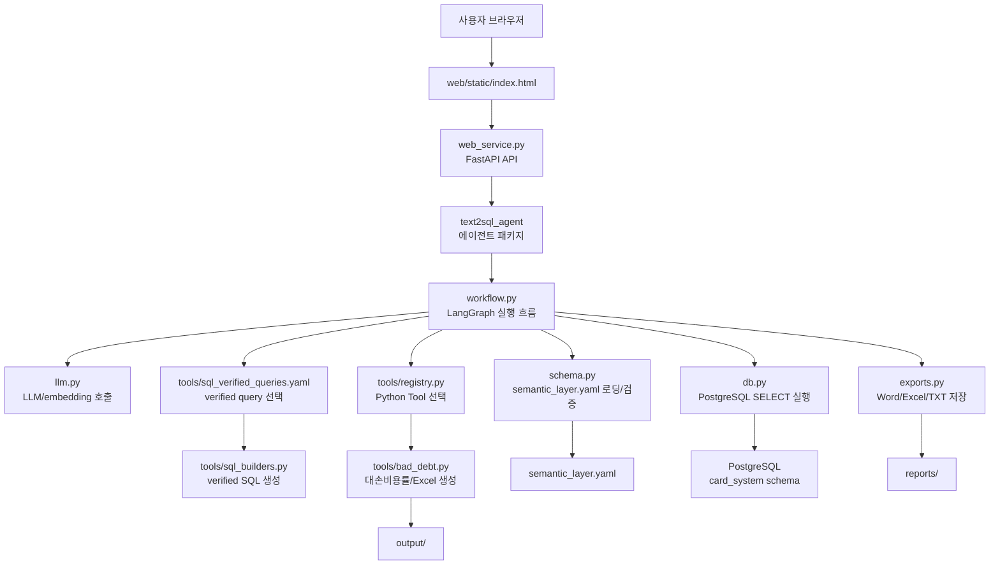

# Text2SQL Webservice v4

`v4`는 `kbcard-agent-common`의 LLM/embedding 클라이언트를 사용하고, PostgreSQL 또는
Amazon Athena를 읽기 전용으로 조회하는 사내 NL2SQL 서비스입니다. 배포 의존성은
`requirements.docker.txt`와 `wheels/`에 고정되어 있습니다.

이제 에이전트의 공식 진입점은 `text2sql_agent` 패키지입니다. 웹서비스도
`import text2sql_agent as agent`로 직접 패키지를 사용하므로, 오래된 `app_vllm_v10.py`
호환 파일은 제거했습니다.

## 전체 구조도



## 폴더 구조

```text
corporate-sales/
  web_service.py                # FastAPI 웹서비스, UI/API endpoint
  semantic_layer.yaml           # 테이블/메트릭/용어/조인 시맨틱 레이어
  requirements.docker.txt       # 배포 Python 의존성
  Dockerfile                    # Docker 실행용 설정
  README.md                     # 현재 문서

  web/
    static/
      index.html                # 브라우저 UI
      styles.css                # UI 스타일

  text2sql_agent/
    __init__.py                 # 주요 공개 API re-export
    __main__.py                 # python -m text2sql_agent 실행 진입점
    config.py                   # 환경 변수와 기본 경로 설정
    common_services.py          # common SDK logging/trace adapter
    llm.py                      # vLLM chat/embedding API 호출
    db.py                       # PostgreSQL 연결과 안전한 SELECT 실행
    schema.py                   # schema 로딩, prompt context 생성, SQL 검증
    state.py                    # LangGraph state 타입 정의
    workflow.py                 # LangGraph 노드, 라우팅, 그래프 구성
    exports.py                  # Word/Excel/TXT 내보내기
    cli.py                      # 터미널 대화형 실행 인터페이스
    tools/
      __init__.py
      registry.py               # Python Tool 메타데이터 등록 (대손비용률)
      sql_verified_queries.yaml # 모든 verified query 정의
      verified_queries.py       # 외부 verified query 로딩/정규화
      sql_builders.py           # verified query SQL 생성 함수와 파라미터 유틸
      bad_debt.py               # 대손비용률 분석 Tool과 Excel 생성
```

## 주요 파일 설명

- `web_service.py`: FastAPI 앱입니다. 브라우저 UI 제공, 세션 관리, 스트리밍 응답, 파일 다운로드, export API를 담당합니다.
- `text2sql_agent/llm.py`: `KBCardOpenAI.from_config(...)`, `EmbeddingClient.from_config(...)`를 통해 LLM/embedding을 호출합니다.
- `text2sql_agent/common_services.py`: webservice가 쓰는 trace/logging adapter입니다. `kbcard-agent-common`의 `KBCardLogger`를 사용해 실행 로그와 DB 모듈 로그를 stdout 또는 JSONL 파일로 남깁니다.
- `text2sql_agent/__init__.py`: 웹서비스나 외부 코드에서 사용할 주요 공개 API를 한 곳에서 제공합니다.
- `text2sql_agent/__main__.py`: `python -m text2sql_agent` 실행 시 CLI를 시작하는 진입점입니다.
- `text2sql_agent/workflow.py`: 질문 분류, 도메인 라우팅, capability 선택, verified query 매칭, SQL 생성/검증/실행, 답변 생성을 LangGraph로 연결합니다.
- `text2sql_agent/schema.py`: `semantic_layer.yaml`을 읽고 테이블/메트릭/용어집/조인 그래프를 prompt context로 가공합니다.
- `text2sql_agent/tools/`: 대손비용률 Python Tool과 외부 verified query 파일을 관리합니다.
- `text2sql_agent/db.py`: 위험한 SQL 명령을 차단하고 읽기 전용 조회를 수행합니다. `DB_BACKEND`에 따라 PostgreSQL 또는 Amazon Athena(pyathena)로 실행되며, 검증 가드는 백엔드 공통입니다.
- `text2sql_agent/exports.py`: 조회 결과를 Word, Excel, TXT 파일로 저장합니다.

## Tool과 verified query

- Python Tool은 `대손비용률_분석`만 유지합니다. 대손비용률과 보정계수 반영 대손율을 계산하고 Excel 결과를 생성합니다.
- schema에 있던 verified query와 SQL 생성 템플릿은 `text2sql_agent/tools/sql_verified_queries.yaml`에서 한 곳에 관리합니다.
- 런타임은 semantic schema의 물리 테이블 31개(기존 정의서 30개 + 월 기업고객 스냅샷 1개)에 맞는 쿼리만 활성화합니다. 관리기업 범위는 semantic table로 등록하지 않고 `관리기업목록` 요청 파라미터에서 실행 시 VALUES CTE로 생성합니다. 현재 스키마에 없는 물리 테이블을 참조하는 항목은 `disabled_verified_queries`로 분리되어 모델 매칭·실행 대상에서 제외됩니다.
- 다른 verified query 파일을 쓰려면 `VERIFIED_QUERY_FILE_PATH`를 지정하고, 배포 전에 `python scripts/run_quality_eval.py`로 테이블 정합성을 확인합니다.

### 관리기업 목록 파라미터 입력

`내가 관리하는 기업` 질의는 `list_k120879_tmp` 같은 공용 임시 테이블을 전제로 하지 않습니다.
질의에 목록이 없으면 웹 UI가 `관리기업목록` 파라미터를 요청합니다.

- 사업자등록번호를 쉼표 또는 줄바꿈으로 직접 입력합니다.
- 하이픈이 포함된 10자리 번호도 입력할 수 있습니다.
- 작업 흐름 아래에 표시되는 기본값을 확인하거나 수정한 뒤 `계속`을 누릅니다.

입력한 값은 하이픈 제거·10자리 형식 검증·중복 제거 후 최대 5,000개까지 요청 파라미터로 전달합니다.
검증된 값은 아래처럼 현재 Athena SQL의 `VALUES` CTE로만 확장되고
다른 사용자나 다음 요청과 공유되지 않습니다.

```sql
managed_scope ("사업자등록번호") AS (
  VALUES ('1234567890'), ('2345678901')
)
```

## 실행 방법

로컬 Python 환경에서 실행:

```bash
cd corporate-sales
uv venv --python 3.12
uv pip install -r requirements.docker.txt

# 최초 1회: 템플릿(.example)에서 로컬 설정 파일(.local)을 생성한 뒤 실제 값을 채운다.
# .env.local / config/*.local.yaml 은 비밀·환경별 값이라 git에 올리지 않으므로(.gitignore)
# clone 직후나 새 서버에서는 직접 만들어야 한다. 이미 있으면 건드리지 않는다(--force로 재생성).
./scripts/setup-config.sh

uv run uvicorn web_service:app --host 0.0.0.0 --port 8080
```

브라우저에서 접속:

```text
http://localhost:8080
```

터미널 대화형 CLI로 실행:

```bash
cd corporate-sales
uv run python -m text2sql_agent
```

## kbcard-agent-common 연결

common SDK 문서의 Getting Started 기준에 맞춰 Python `3.12`에서 uv로 의존성을 설치합니다.
망분리 Linux 배포에서는 저장소의 wheel 묶음만 사용해 설치할 수 있습니다.

```bash
cd corporate-sales
uv venv --python 3.12
uv pip install --no-index --find-links=wheels -r requirements.docker.txt
```

이 서비스도 common SDK 방식에 맞춰 `KBCARD_CONFIG_PATH`가 있으면 agent YAML과 model registry YAML을
먼저 읽습니다. LLM은 `KBCardOpenAI.from_config(...)`, embedding은 `EmbeddingClient.from_config(...)`를
우선 사용하고, YAML이 없을 때만 기존 환경 변수 기반 endpoint 설정으로 fallback합니다.

## common 기능 사용 범위

- LLM Client: `KBCardOpenAI`로 OpenAI Chat Completions 호환 endpoint를 호출합니다.
- Embedding: `EmbeddingClient`로 TEI/OpenAI 호환 `/v1/embeddings` endpoint를 호출합니다. YAML 설정이 없을 때만 `TEIEmbeddingClient` 직접 생성으로 폴백합니다.
- Logging: `KBCardLogger.from_config(...)`로 서비스 실행 로그와 DB query module event 로그를 남깁니다. `request_id`, `trace_id`, `message_id`, `session_id`는 `common_services.create_trace_context(...)`에서 생성해 같은 요청 흐름 안에서 공유합니다.

이번 Text2SQL 과제는 업무 DB를 SQL로 조회하는 서비스이므로 common SDK의 retrieval, reranker, Markdown ingestion, pgvector provider, tracing, errors API는 넣지 않았습니다. Postgres 접속 정보는 서비스 자체 설정으로 처리하되 `KBCARD_POSTGRES_DSN` 환경 변수도 계속 지원합니다.

## Docker 실행

```bash
cd corporate-sales
docker build --build-arg APP_RELEASE="$(git rev-parse --short HEAD)" -t text2sql-webservice:v4 .
docker run --rm -p 8080:8080 --env-file .env.local text2sql-webservice:v4
```

`.env.local`은 이미지에 복사되지 않으며 반드시 실행 시 `--env-file`, ECS task secret 또는
Kubernetes Secret으로 주입합니다. `config/models*.yaml`에도 실제 키를 쓰지 말고
`api_key_env: LLM_API_KEY`처럼 환경 변수 이름만 둡니다.

현재 오프라인 `wheels/` 묶음은 CPython 3.12 + Linux x86_64 배포를 기준으로 검증했습니다.
다른 Python 버전이나 ARM 서버를 사용하면 해당 플랫폼에서 wheel 묶음을 다시 생성해야 합니다.

ECS/ALB에서 SSE 응답이 중간에 끊길 때의 요청 ID 조회와 CloudWatch 판정 방법은
[`docs/sse-ecs-troubleshooting.md`](docs/sse-ecs-troubleshooting.md)를 참고합니다.

## 환경 변수

common SDK 문서 기준의 권장 방식은 `.env`에는 config 경로와 secret만 두고, endpoint/model 설정은 YAML에 두는 것입니다.

```bash
KBCARD_CONFIG_PATH=config/agent.example.yaml
# Amazon Bedrock OpenAI 호환 gpt-oss를 쓸 때의 인증 토큰 (Amazon Bedrock API key).
AWS_BEARER_TOKEN_BEDROCK=...
# 로컬 vLLM을 쓸 때만 필요 (Bedrock 경로에서는 사용 안 함).
LLM_API_KEY=EMPTY

# 업무 데이터 조회는 Athena
DB_BACKEND=athena
ATHENA_REGION=ap-northeast-2
ATHENA_WORKGROUP=primary
ATHENA_DATABASE=card_system
ATHENA_CATALOG=AwsDataCatalog

# ECS/ALB 운영 시 웹 세션/메시지/후속질문 결과는 PostgreSQL에 저장
WEBAPP_SESSION_STORE=postgres
KBCARD_POSTGRES_SECRET_ID=keyscr-aihub-dev-ane2-agentifo
AWS_REGION=ap-northeast-2
WEBAPP_POSTGRES_SCHEMA=corporate_sales
# 현재 PostgreSQL 계정에 DELETE 권한이 없으면 false. 권한 부여 후 true로 전환
WEBAPP_POSTGRES_DELETE_ENABLED=false

# 운영 로그는 DB에 저장하지 않고 stdout JSONL로 출력
KBCARD_LOG_LEVEL=INFO
KBCARD_LOG_FORMAT=jsonl
# 선택: PostgreSQL이 원본이고 Redis는 result/file token 보조 캐시입니다.
WEBAPP_REDIS_URL="redis://redis.xxxx.cache.amazonaws.com:6379/0"

# 보존 정책. 0이면 해당 제한을 끕니다.
WEBAPP_MAX_SESSIONS_PER_USER=50
WEBAPP_MAX_MESSAGES_PER_SESSION=80
WEBAPP_RESULT_RETENTION_DAYS=7
WEBAPP_FILE_RETENTION_DAYS=7
WEBAPP_SESSION_RETENTION_DAYS=60
```

`AWS_BEARER_TOKEN_BEDROCK`에는 Amazon Bedrock API key를 넣어야 합니다. Claude Code/Anthropic용 bearer token을
넣으면 AWS가 `Invalid API Key format`으로 거절합니다.

### 로깅

`config/agent.example.yaml`의 `logger` 섹션은 `kbcard-agent-common`의 `KBCardLogger.from_config(...)`로 읽힙니다.
기본 출력 위치는 stdout입니다. ECS 운영에서는 stdout을 유지하고 JSONL 포맷만 지정하면
컨테이너 로그 드라이버를 통해 CloudWatch로 전달할 수 있습니다.

```bash
KBCARD_LOG_LEVEL=INFO
KBCARD_LOG_FORMAT=jsonl
```

PostgreSQL에는 운영 로그를 적재하지 않습니다.

### 웹 세션 저장소 (ECS/ALB 권장)

브라우저 UI의 멀티턴 상태는 FastAPI worker 메모리가 아니라 저장소에 보관합니다. 운영에서는
`WEBAPP_SESSION_STORE=postgres`와 `KBCARD_POSTGRES_SECRET_ID`를 지정하세요. Secret은
`POSTGRES_HOST`, `POSTGRES_PORT`, `POSTGRES_USER`, `POSTGRES_PASSWORD`와 선택 항목인
`POSTGRES_DB`를 JSON 키로 포함해야 합니다. `corporate_sales` 스키마와 다음 테이블은 배포 전에
미리 준비해야 하며, 애플리케이션은 스키마나 테이블을 생성하지 않습니다.

`WEBAPP_POSTGRES_DELETE_ENABLED=false`이면 PostgreSQL에는 `DELETE`를 실행하지 않습니다. 세션 삭제 버튼은
해당 브라우저의 목록에서만 세션을 숨기며 DB 행은 유지합니다. 권한 부여 후 `true`로 바꾸면 숨긴 세션이
다시 표시되고 실제 삭제를 사용할 수 있습니다.

- `webapp_sessions`: 사용자별 대화방, 마지막 결과, 누락 파라미터 continuation
- `webapp_messages`: user/assistant 메시지 본문과 응답 payload
- `webapp_results`: 후속질문/export에 필요한 result payload
- `webapp_files`: 다운로드 token과 실제 파일 경로

명시적인 DSN을 사용해야 하는 환경에서는 `WEBAPP_POSTGRES_DSN`을 지정할 수 있습니다. 이 값이 없으면
Secret의 개별 PostgreSQL 접속 항목을 사용하며, `KBCARD_POSTGRES_DSN`, `DATABASE_URL`, `DB_DSN`도
호환성을 위해 우선순위가 높은 명시적 DSN으로 인식합니다.
업무 조회 DB를 읽기 전용 계정으로 운영한다면 세션 저장용 RDS/스키마와 쓰기 가능한 계정을 별도로 두는 편이 안전합니다.
Redis는 선택 사항이며 `WEBAPP_REDIS_URL`을 지정하면 result/file token을 TTL 캐시하지만, 원본은 계속 PostgreSQL입니다.
저장소는 무한 누적하지 않고 다음 보존 정책을 적용합니다. `0`을 지정하면 해당 제한만 끕니다.

- `WEBAPP_MAX_SESSIONS_PER_USER`: 사용자별 최근 세션만 유지합니다. 기본값은 `50`입니다.
- `WEBAPP_MAX_MESSAGES_PER_SESSION`: 세션별 최근 raw 메시지만 유지합니다. 기본값은 `80`입니다.
- `WEBAPP_RESULT_RETENTION_DAYS`: 후속질문/export용 result payload 보존 기간입니다. 기본값은 `7`일입니다.
- `WEBAPP_FILE_RETENTION_DAYS`: 다운로드 token과 파일 경로 record 보존 기간입니다. 기본값은 `7`일입니다.
- `WEBAPP_SESSION_RETENTION_DAYS`: 비활성 세션 보존 기간입니다. 기본값은 `60`일입니다.

웹 UI는 기본적으로 브라우저별 익명 `X-User-ID`를 localStorage에 만들고 세션 목록을 사용자별로 분리합니다.
실제 로그인 환경에서는 HTML을 서빙하기 전에 `window.TEXT2SQL_USER_ID`에 사내 사용자 ID를 주입하거나,
API Gateway/ALB 인증 계층에서 `X-User-ID`를 신뢰 가능한 값으로 덮어쓰도록 구성하세요.

### 데이터베이스 백엔드 (PostgreSQL / Amazon Athena)

SQL 실행 백엔드는 `DB_BACKEND` 환경변수로 고릅니다 (`postgres` 기본, `athena` 선택).
호출부(`execute_sql`)는 그대로이고 `db.py` 내부에서만 분기하므로 코드 변경 없이 전환됩니다.

```bash
# 기본: PostgreSQL
DB_BACKEND=postgres
KBCARD_POSTGRES_DSN="host=localhost port=5432 dbname=postgres user=postgres password="

# 전환: Amazon Athena (pyathena DB-API)
DB_BACKEND=athena
ATHENA_REGION=ap-northeast-2
ATHENA_S3_STAGING_DIR=s3://your-athena-results-bucket/path/   # 결과 저장 위치 (워크그룹에 있으면 생략 가능)
ATHENA_WORKGROUP=primary
ATHENA_DATABASE=card_system
ATHENA_CATALOG=AwsDataCatalog
# ATHENA_PROFILE=your-aws-profile     # 선택: 특정 AWS 프로필 사용 시
# ATHENA_ENDPOINT_URL=https://vpce-xxxx.athena.ap-northeast-2.vpce.amazonaws.com  # 선택: VPC 엔드포인트

# 웹 세션/대화 이력은 Secrets Manager의 PostgreSQL 접속 정보로 별도 저장
WEBAPP_SESSION_STORE=postgres
KBCARD_POSTGRES_SECRET_ID=keyscr-aihub-dev-ane2-agentifo
AWS_REGION=ap-northeast-2
WEBAPP_POSTGRES_SCHEMA=corporate_sales
WEBAPP_POSTGRES_DELETE_ENABLED=false

# 운영 로그는 stdout JSONL
KBCARD_LOG_LEVEL=INFO
KBCARD_LOG_FORMAT=jsonl
```

Athena 인증은 코드/설정에 키를 두지 않고 **표준 AWS 자격증명 체인**(환경변수 `AWS_ACCESS_KEY_ID`/
`AWS_SECRET_ACCESS_KEY`, `AWS_PROFILE`, 또는 EC2/ECS IAM 역할)을 그대로 사용합니다.

##### VPC 엔드포인트 / 커스텀 endpoint URL

사내망에서 VPC 엔드포인트(`vpce-...`)나 프록시를 통해 Athena에 접속한다면 `ATHENA_ENDPOINT_URL`을
지정합니다. pyathena가 이 값을 boto3 athena client의 `endpoint_url`로 전달합니다.

- 이 설정은 **Athena API 호출에만** 적용됩니다. 쿼리 결과는 S3에서, 자격증명은 STS에서 가져오므로,
  완전 폐쇄망이면 **S3·STS용 VPC 엔드포인트도 별도로** 있어야 정상 동작합니다 (Athena 엔드포인트만으로는 부족).
- 결과 위치는 `ATHENA_S3_STAGING_DIR` 또는 워크그룹 결과 위치 중 하나만 있으면 됩니다.

- 하드코딩된 verified query SQL(`sql_builders.py`)과 대손비용률 SQL(`bad_debt.py`)은 양쪽 DB에서 동작하도록 ANSI 표준으로
  작성되어 있습니다 (`CAST(... AS DOUBLE/INTEGER)`, `LOWER() LIKE LOWER()`, `SUBSTR`).
- LLM이 새로 생성하는 SQL은 `DB_BACKEND`에 따라 프롬프트가 PostgreSQL/Trino 방언을 자동 안내합니다.

#### 테이블 스키마 prefix (`DB_SCHEMA`)

테이블 참조에 붙는 스키마 한정자는 `DB_SCHEMA`로 설정합니다. PostgreSQL에서는 schema로
해석됩니다. Athena는 pyathena connection의 `schema_name=ATHENA_DATABASE`를 이미 사용하므로,
기본적으로 SQL에는 database prefix를 붙이지 않습니다.

- 미설정 시 기본값: `postgres`면 `card_system`, `athena`면 prefix 없음.
- `DB_SCHEMA`는 verified query SQL · SQL 검증(`schema.py`) · 생성 프롬프트 · schema YAML의
  `physical_table`/verified-query SQL에 **일괄 적용**됩니다 (YAML 원본은 `card_system.`으로
  두고 로드 시 메모리에서 동적 치환).

```bash
# Athena 기본 권장: ATHENA_DATABASE로 접속하고 SQL은 테이블명만 사용
DB_BACKEND=athena
ATHENA_DATABASE=kbcard_db

# database-qualified table을 반드시 써야 하는 환경에서만 명시
DB_SCHEMA=kbcard_db

# PostgreSQL에서 prefix 없이 테이블명만 쓰려면
DB_BACKEND=postgres
DB_SCHEMA=none
```

#### Athena 한글 컬럼명

Athena(Trino/Presto)는 한글 컬럼명을 일반 identifier로 파싱하지 못하므로
`기준년월`처럼 쓰면 `mismatched input '기'` 오류가 날 수 있습니다. Athena에서는
`"기준년월"`, `a."가맹점명"`, `AS "총매출금액"`처럼 double quote로 감싼
delimited identifier를 사용해야 합니다. 이 앱은 `DB_BACKEND=athena`일 때 실행 직전에
한글/비ASCII 식별자를 자동으로 quote합니다. 문자열 값(`'202512'`, `'%한빛%'`)은 그대로 둡니다.

#### Athena 날짜 파티션 메타

Athena 테이블이 업무 날짜 컬럼(`기준년월`, `작업기준년월`, `기준년월일` 등)을 갖고 있지만 실제 저장은
`year`/`month` 또는 `year`/`month`/`day` 파티션으로 되어 있으면, schema의 해당 테이블에
`athena_partition`을 추가합니다. 이 메타가 있는 테이블만 verified query SQL에서 파티션 조건을 자동 추가하고,
메타가 없는 테이블은 기존 SQL 그대로 실행되므로 날짜 파티션이 아닌 테이블에서도 오류가 나지 않습니다.

월 파티션 예시:

```yaml
- name: tmdaa3e16
  physical_table: card_system.tmdaa3e16
  time_dimensions:
  - name: 기준년월
    expr: 기준년월
    data_type: VARCHAR
  athena_partition:
    source_time_dimension: 기준년월
    source_format: YYYYMM
    keys:
    - name: year
      format: YYYY
      data_type: string
    - name: month
      format: MM
      data_type: string
```

일 파티션 예시:

```yaml
athena_partition:
  source_time_dimension: 전표매출년월일
  source_format: YYYYMMDD
  keys:
  - name: year
    format: YYYY
    data_type: string
  - name: month
    format: MM
    data_type: string
  - name: day
    format: DD
    data_type: string
```

회사 Athena DDL에서 파티션 키가 `daty`라면 `day` 대신 `name: daty`로 적으면 됩니다.

기본 schema는 `semantic_layer.yaml`입니다. `테이블 내용 예시_001.xlsx`의 30개 테이블·2,061개 컬럼과
`예시.xlsx`의 `tmdaa1d12` 월 스냅샷 79개 컬럼(`tbdaaat18`은 기존 정의 교차 검증)을 합쳐 총 31개 테이블·2,140개 원천 컬럼으로 구성합니다.
`athena_text2sql_reference.xlsx`의 기본 9개·추가 3개 질의를 기준으로 기업영업 semantic contract를 구성하며,
실행용 Athena VQ는 `text2sql_agent/tools/sql_verified_queries.yaml`에서 관리합니다.
다른 schema를 쓰려면 다음 환경 변수를 지정하면 됩니다.

```bash
SEMANTIC_SCHEMA_PATH=/absolute/path/to/schema.yaml
```

### 로컬/회사 endpoint 분리

기본 예시는 `config/agent.example.yaml`과 `config/models.example.yaml`입니다. 로컬 값은 복사해서
`config/agent.local.yaml`, `config/models.local.yaml`로 두고 `.env.local`에서 `KBCARD_CONFIG_PATH`만 바꾸면 됩니다.

```bash
cp config/agent.example.yaml config/agent.local.yaml
cp config/models.example.yaml config/models.local.yaml
```

`agent.local.yaml`:

```yaml
agent:
  name: text2sql-v4
  environment: local
  service_name: text2sql-v4-local

llm:
  model_registry_path: models.local.yaml
  # 기본은 Bedrock OpenAI 호환 gpt-oss-120b. 가벼운 20b나 로컬 vLLM(local-chat)으로 교체 가능.
  default_model: "openai.gpt-oss-120b-1:0"
  temperature: 0
  max_tokens: 4096
  timeout: 120

embedding:
  provider: tei
  # OpenAI 호환 /v1/embeddings 를 노출하는 임베딩 서버.
  base_url: http://127.0.0.1:8124
  model: intfloat/multilingual-e5-small
  api_key: null
  timeout: 60
```

`models.local.yaml`:

```yaml
models:
  # Amazon Bedrock OpenAI 호환 runtime (gpt-oss).
  # 공통 모듈(KBCardOpenAI)이 base_url+endpoint_path로 호출하고,
  # api_key_env에서 읽은 토큰을 Authorization: Bearer 로 전송한다.
  # 기본은 120b. 작은 20b는 Tool 선택을 자주 놓쳐(예: 대손비용률) 120b를 표준으로 둔다.
  "openai.gpt-oss-120b-1:0":
    provider: bedrock
    base_url: https://bedrock-runtime.us-east-1.amazonaws.com
    endpoint_path: /openai/v1/chat/completions
    api_key_env: AWS_BEARER_TOKEN_BEDROCK
    timeout: 120
    capabilities:
      streaming: false

  # 더 작고 빠른 폴백 모델.
  "openai.gpt-oss-20b-1:0":
    provider: bedrock
    base_url: https://bedrock-runtime.us-east-1.amazonaws.com
    endpoint_path: /openai/v1/chat/completions
    api_key_env: AWS_BEARER_TOKEN_BEDROCK
    timeout: 120
    capabilities:
      streaming: false

  # 로컬 vLLM 폴백.
  local-chat:
    provider: vllm
    base_url: http://127.0.0.1:8000
    endpoint_path: /v1/chat/completions
    api_key_env: LLM_API_KEY
    timeout: 120
    capabilities:
      streaming: false
```

### 로컬 임베딩 서버

임베딩은 작은 한국어 지원 모델 `intfloat/multilingual-e5-small`을 OpenAI 호환
`/v1/embeddings` 형식으로 노출해 사용합니다. `sentence-transformers` 기반 서버를 띄웁니다.

```bash
uv run uvicorn embedding_server:app --app-dir .local --host 0.0.0.0 --port 8124
```

공통 모듈의 `TEIEmbeddingClient`가 이 endpoint를 그대로 호출하므로, 별도 코드 변경 없이
`agent.local.yaml`의 `embedding.base_url`만 맞추면 됩니다.

`LLM_BASE_URL`, `LLM_MODEL`, `EMBED_BASE_URL`, `DB_HOST` 같은 환경 변수로 YAML 값을 덮어쓸 수 있지만,
`KBCARD_CONFIG_PATH` YAML을 두는 방식을 우선 권장합니다. (LLM/임베딩 호출은 모두
`kbcard-agent-common`의 OpenAI 호환 클라이언트를 단일 경로로 사용합니다.)

`kbcard-agent-common` 문서 기준으로는 uv 환경을 권장합니다.

```bash
uv venv --python 3.12
uv pip install -r requirements.docker.txt
```

### Capability router 라우팅 정밀도

Tool과 verified query는 실행 방식은 분리하지만, 선택은 하나의 capability router에서 처리합니다. 질문이 broad하게 들어올 때는 잘못된 Tool이나 사전 쿼리를 쓰는 것보다 자동 SQL 생성으로 넘기는 편이 안전합니다. 기본값은 정밀도 우선입니다.

```bash
# verified query embedding 매칭을 쓸 때 필요한 최소 유사도
EMBED_MATCH_THRESHOLD=0.86

# verified query 매칭 전체 on/off
ENABLE_VERIFIED_QUERY_MATCHING=true

# embedding 실패/비활성 시 LLM이 verified query 목록에서 고르는 fallback.
# 오탐이 많아 기본값은 false입니다.
ENABLE_VERIFIED_QUERY_LLM_FALLBACK=false

# LLM fallback을 켤 때도 lexical 후보를 좁혀서 전달합니다.
VERIFIED_QUERY_LLM_CANDIDATE_LIMIT=8
VERIFIED_QUERY_MIN_LEXICAL_SCORE=2
VERIFIED_QUERY_RULE_MATCH_THRESHOLD=5
VERIFIED_QUERY_RULE_MATCH_MARGIN=2
```

## 처리 흐름

1. 사용자가 웹 UI에서 질문을 입력합니다.
2. `web_service.py`가 요청을 받아 LangGraph 실행을 시작합니다.
3. `workflow.py`가 질문을 `need_sql`, `direct`, `reject` 중 하나로 분류합니다.
4. SQL이 필요한 질문은 도메인 라우팅 후 capability router에서 Tool, verified query, 자동 SQL 생성 경로 중 하나로 진행합니다.
5. 생성된 SQL은 `schema.py`의 검증과 `db.py`의 안전 실행 로직을 거칩니다.
6. 조회 결과는 LLM을 통해 표/요약 중심 답변으로 변환됩니다.
7. 사용자가 export를 요청하면 `exports.py`가 Word/Excel/TXT 파일을 `reports/`에 생성합니다.

## 소형 모델 대응과 품질 검증

Gemma 계열이나 gpt-oss 20B처럼 지시 이행력이 낮은 모델에서도 핵심 경로가 유지되도록 다음 원칙을 적용합니다.

- 명확한 질문 분류·도메인·Tool·기간·금액·상위 N개는 규칙으로 먼저 결정하고, 모호한 부분만 LLM에 맡깁니다.
- 단계마다 출력 토큰을 제한하고 reasoning/think wrapper, 코드 fence, 불완전한 JSON·SQL을 정규화합니다.
- 모델 출력이 비정상이거나 모델이 일시적으로 끊겨도 규칙 기반 파라미터, 테이블 후보, 결과 요약으로 폴백합니다.
- `semantic_layer.yaml`의 도메인·엔티티·메트릭·안전 조인 경로와 질문 관련 테이블만 짧게 전달해 프롬프트를 제한합니다.
- 문서의 12개 기준 질의는 정규화된 phrase → domain → 필수 테이블 → verified query 순서로 규칙 매칭해 LLM 호출 없이도 정확한 SQL 템플릿을 선택합니다.
- 일별 스냅샷은 고객·월 최신행으로 먼저 축소하고, 직접식별정보 테이블과 민감 컬럼은 일반 semantic prompt에서 제외합니다.
- 멀티턴 SQL은 직전 질문·SQL·답변과 실제 후속 질문을 별도 필드로 전달해 기간/정렬 변경이 긴 합성 질문에 묻히지 않게 합니다.
- 모델이 만든 SQL은 schema 검증과 실행 직전 read-only 검증을 모두 통과해야 하며, 현재 schema에 없는 verified query는 자동 비활성화합니다.

모델·DB 없이 실행 가능한 회귀 테스트와 오프라인 품질 계약을 배포 전에 모두 실행합니다.

```bash
PYTHONDONTWRITEBYTECODE=1 pytest -q
PYTHONDONTWRITEBYTECODE=1 python scripts/run_quality_eval.py
```

품질 계약은 noisy JSON/SQL 파싱, 후속 질문 라우팅, 자연어 파라미터, 다중 문장·변경 SQL 차단,
재시도 경로, semantic join 및 verified-query 테이블 정합성을 검사합니다.

## 출력 파일

- 대손비용률 Excel 파일: `output/`
- 일반 보고서 export 파일: `reports/`

두 폴더는 실행 중 필요할 때 자동 생성됩니다.

## 코드에서 사용하기

리팩토링 후에는 `text2sql_agent` 패키지를 직접 import합니다.

```python
import text2sql_agent as agent

graph = agent.build_graph()
state = agent._new_initial_state("2025년 월별 법인카드 이용금액 보여줘")
```

`app_vllm_v10.py`는 더 이상 사용하지 않습니다. 예전 코드에서
`import app_vllm_v10 as agent`를 사용했다면 위처럼 `import text2sql_agent as agent`로 바꾸면 됩니다.
