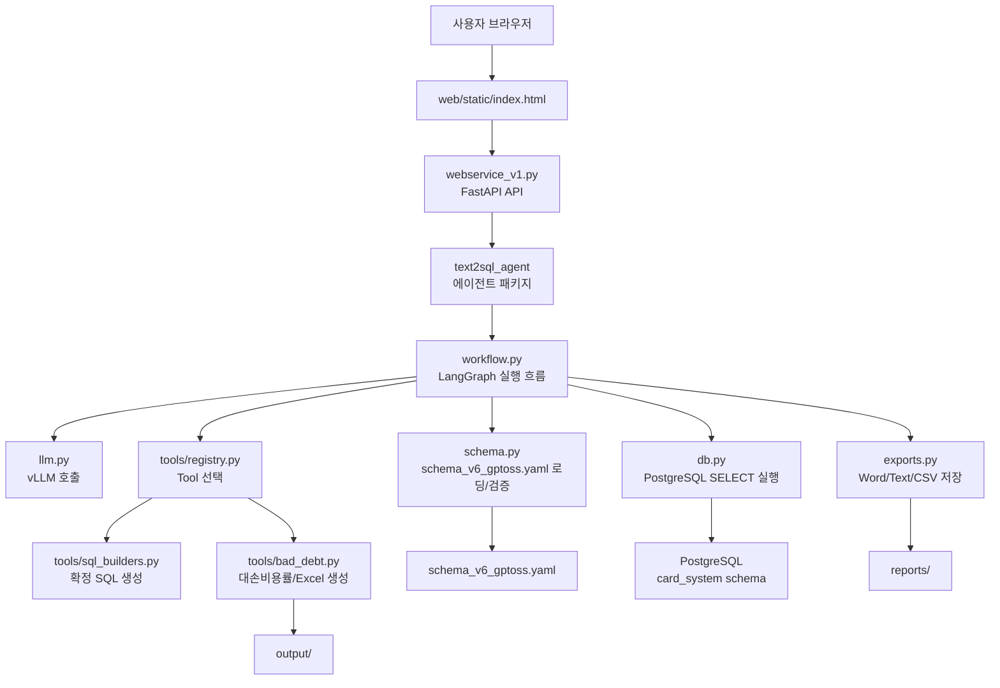

# Text2SQL Webservice v4

`v4`는 `v3`를 기준으로 하되, 이 과제에서 실제로 쓰는 LLM, embedding, observability, errors 공통 모듈만
[`kduk/kbcard-agent-common`](https://github.com/kduk/kbcard-agent-common/tree/main)에서
가져오도록 만든 버전입니다. common SDK는 `requirements.txt`의 pip 의존성으로 설치합니다.

이제 에이전트의 공식 진입점은 `text2sql_agent` 패키지입니다. 웹서비스도
`import text2sql_agent as agent`로 직접 패키지를 사용하므로, 오래된 `app_vllm_v10.py`
호환 파일은 제거했습니다.

## 전체 구조도



## 폴더 구조

```text
v4/
  webservice_v1.py              # FastAPI 웹서비스, UI/API endpoint
  schema_v6_gptoss.yaml         # 기본 semantic schema, schema_v7 기업영업 내용 병합본
  requirements.txt              # Python 의존성
  Dockerfile                    # Docker 실행용 설정
  README.md                     # 현재 문서

  web/
    static/
      index.html                # 브라우저 UI
      styles.css                # UI 스타일

  text2sql_agent/
    __init__.py                 # 주요 공개 API re-export
    __main__.py                 # python -m text2sql_agent 실행 진입점
    config.py                   # 환경 변수와 기본 경로 설정
    llm.py                      # vLLM chat/embedding API 호출
    db.py                       # PostgreSQL 연결과 안전한 SELECT 실행
    schema.py                   # schema 로딩, prompt context 생성, SQL 검증
    state.py                    # LangGraph state 타입 정의
    workflow.py                 # LangGraph 노드, 라우팅, 그래프 구성
    exports.py                  # Word/Text/CSV 내보내기
    cli.py                      # 터미널 대화형 실행 인터페이스
    tools/
      __init__.py
      registry.py               # Tool 메타데이터 등록
      sql_builders.py           # 확정 SQL 생성 함수와 파라미터 유틸
      bad_debt.py               # 대손비용률 분석 Tool과 Excel 생성
```

## 주요 파일 설명

- `webservice_v1.py`: FastAPI 앱입니다. 브라우저 UI 제공, 세션 관리, 스트리밍 응답, 파일 다운로드, export API를 담당합니다.
- `text2sql_agent/llm.py`: common SDK의 `KBCardOpenAI`, `TEIEmbeddingClient`를 사용합니다. common SDK가 없는 개발 환경에서는 기존 `requests` 호출로 LLM/embedding만 폴백합니다.
- `text2sql_agent/common_services.py`: common SDK의 실행 로그, 모듈 audit 로그, 공통 error 매핑만 얇게 감싼 adapter입니다.
- `text2sql_agent/__init__.py`: 웹서비스나 외부 코드에서 사용할 주요 공개 API를 한 곳에서 제공합니다.
- `text2sql_agent/__main__.py`: `python -m text2sql_agent` 실행 시 CLI를 시작하는 진입점입니다.
- `text2sql_agent/workflow.py`: 질문 분류, 도메인 라우팅, Tool 선택, verified query 매칭, SQL 생성/검증/실행, 답변 생성을 LangGraph로 연결합니다.
- `text2sql_agent/schema.py`: `schema_v6_gptoss.yaml`을 읽고 테이블/메트릭/용어집/조인 그래프를 prompt context로 가공합니다.
- `text2sql_agent/tools/`: 확정 SQL 기반 Tool을 관리합니다. 일반 Tool은 SQL 문자열을 만들고, 대손비용률 Tool은 SQL 실행과 Excel 생성까지 수행합니다.
- `text2sql_agent/db.py`: 위험한 SQL 명령을 차단하고 PostgreSQL에서 읽기 전용 조회를 수행합니다.
- `text2sql_agent/exports.py`: 조회 결과를 Word, Text, CSV 파일로 저장합니다.

## 주요 Tool

- `가맹점_카드소지_실적_조회`: 가맹점 기본정보, 업종명, 기준월 실적, 대표자 개인카드/기업고객 기업카드 소지 여부를 함께 조회합니다. 개인카드 미보유 또는 기업카드 미보유 영업대상 추출에 사용합니다.
- `가맹점_매출_순위`: 기준월 구간의 매출 상위 가맹점과 업종 정보를 조회합니다.
- `업종별_매출_분석`: 업종 기준 매출 금액과 건수를 조회합니다.
- `대손비용률_분석`: 대손비용률과 보정계수 반영 대손율을 계산하고 Excel 결과를 생성합니다.

## 실행 방법

로컬 Python 환경에서 실행:

```bash
cd /Users/minsu/Documents/company/franchise/text2sql_v10/v4
pip install -r requirements.txt
uvicorn webservice_v1:app --host 0.0.0.0 --port 8080
```

브라우저에서 접속:

```text
http://localhost:8080
```

터미널 대화형 CLI로 실행:

```bash
cd /Users/minsu/Documents/company/franchise/text2sql_v10/v4
python -m text2sql_agent
```

## kbcard-agent-common 연결

common SDK 문서의 Getting Started 기준에 맞춰 Python `3.12`에서 pip 의존성으로 설치합니다.
문서에서는 사내 PyPI 설치를 기본으로 설명하지만, 현재 작업 환경은 SSH clone이 가능하므로
`requirements.txt`에서 GitHub SSH dependency로 직접 연결했습니다.

```bash
cd /Users/minsu/Documents/company/franchise/text2sql_v10/v4
python -m pip install -r requirements.txt
```

의존성은 이 과제에서 쓰는 `llm` extra만 지정합니다.

```text
kbcard-agent-common[llm] @ git+ssh://git@github.com/kduk/kbcard-agent-common.git@main
```

Getting Started의 단발 예제는 `from_config_path(...)`를 사용하지만, 이 서비스는 기존 `VLLM_*`
환경 변수를 그대로 쓰기 위해 SDK의 직접 endpoint factory인 `KBCardOpenAI.from_endpoint(...)`를 사용합니다.

## common 기능 사용 범위

- LLM Client: `KBCardOpenAI`로 OpenAI Chat Completions 호환 endpoint를 호출합니다.
- Embedding: `TEIEmbeddingClient`로 `/v1/embeddings`를 호출합니다.
- Agent 실행 로그: `TraceContext`, `observability_context`, `ExecutionLogRecord`로 요청 단위 실행 결과를 남깁니다.
- Module audit logging: `observability_context` 안에서 common LLM/embedding 호출은 `llm_call`, `embedding_call` 이벤트를 자동 기록하고, `db.py`는 `db_query` 이벤트를 직접 기록합니다.
- Errors: common SDK의 `ConfigurationError`, `ProviderError`, `RetryableProviderError`, `CapabilityNotSupportedError`, `KBCardAgentError`를 API 응답 status로 매핑합니다.

이번 Text2SQL 과제는 업무 DB를 SQL로 조회하는 서비스이므로 common SDK의 retrieval, reranker, Markdown ingestion, pgvector provider, reindex/upsert API는 넣지 않았습니다.

## Docker 실행

```bash
cd /Users/minsu/Documents/company/franchise/text2sql_v10/v4
docker build -t text2sql-webservice:v4 .
docker run --rm -p 8080:8080 --env-file .env text2sql-webservice:v4
```

## 환경 변수

필요한 값은 `.env` 또는 실행 환경 변수로 설정합니다.

```bash
VLLM_BASE_URL=http://localhost:8000
VLLM_MODEL=gpt-oss
VLLM_API_KEY=EMPTY

VLLM_EMBED_URL=http://localhost:8000
VLLM_EMBED_MODEL=embedding-model
VLLM_EMBED_API_KEY=EMPTY
ENABLE_EMBEDDING_PRECOMPUTE=false
EMBED_MATCH_THRESHOLD=0.75

KBCARD_AGENT_ENV=local
KBCARD_SERVICE_NAME=text2sql-v4
KBCARD_LOG_FORMAT=jsonl
KBCARD_LOG_LEVEL=INFO
KBCARD_LOG_PAYLOAD_MODE=summary

DB_HOST=localhost
DB_PORT=5432
DB_NAME=postgres
DB_USER=postgres
DB_PASSWORD=
```

기본 schema는 `v4/schema_v6_gptoss.yaml`입니다. 기존 `schema_v7_enterprise_sales_gptoss.yaml`의
기업영업 가맹점/특수채권/대손충당금 테이블과 예시는 이 파일에 병합했고, 중복 파일은 제거했습니다.
다른 schema를 쓰려면 다음 환경 변수를 지정하면 됩니다.

```bash
SEMANTIC_SCHEMA_PATH=/absolute/path/to/schema.yaml
```

### 로컬/회사 endpoint 분리

코드는 기존 `VLLM_*` 이름을 계속 지원하면서, 회사/로컬 분리를 위해 더 일반적인 이름도 함께 읽습니다.

```bash
LLM_BASE_URL=https://api.openai.com
LLM_MODEL=gpt-4.1-mini
OPENAI_API_KEY=...

EMBED_BASE_URL=http://127.0.0.1:8124
EMBED_MODEL=intfloat/multilingual-e5-small
```

회사 환경에서는 위 값을 사내 LLM/embedding gateway URL로 바꾸면 됩니다. 로컬 전용 값은 `.env.local`에 둘 수 있고, 이 파일은 Git에 올라가지 않도록 무시됩니다.

`kbcard-agent-common` 문서 기준으로는 uv 환경을 권장합니다.

```bash
uv venv --python 3.12
uv pip install -r requirements.txt
```

## 처리 흐름

1. 사용자가 웹 UI에서 질문을 입력합니다.
2. `webservice_v1.py`가 요청을 받아 LangGraph 실행을 시작합니다.
3. `workflow.py`가 질문을 `need_sql`, `direct`, `reject` 중 하나로 분류합니다.
4. SQL이 필요한 질문은 도메인 라우팅 후 Tool, verified query, 자동 SQL 생성 경로 중 하나로 진행합니다.
5. 생성된 SQL은 `schema.py`의 검증과 `db.py`의 안전 실행 로직을 거칩니다.
6. 조회 결과는 LLM을 통해 표/요약 중심 답변으로 변환됩니다.
7. 사용자가 export를 요청하면 `exports.py`가 Word/Text/CSV 파일을 `reports/`에 생성합니다.

## 출력 파일

- 대손비용률 Excel 파일: `output/`
- 일반 보고서 export 파일: `reports/`

두 폴더는 실행 중 필요할 때 자동 생성됩니다.

## 코드에서 사용하기

리팩토링 후에는 `text2sql_agent` 패키지를 직접 import합니다.

```python
import text2sql_agent as agent

graph = agent.build_graph()
state = agent._new_initial_state("2025년 월별 법인카드 이용금액 보여줘")
```

`app_vllm_v10.py`는 더 이상 사용하지 않습니다. 예전 코드에서
`import app_vllm_v10 as agent`를 사용했다면 위처럼 `import text2sql_agent as agent`로 바꾸면 됩니다.
