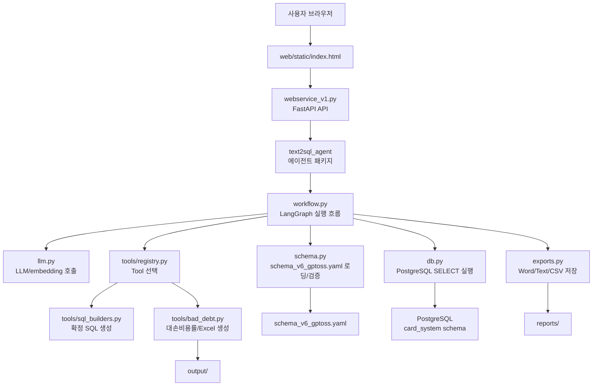

# Text2SQL Webservice v4

`v4`는 `v3`를 기준으로 하되, 이 과제에서 실제로 쓰는 LLM과 embedding 공통 모듈만
[`kduk/kbcard-agent-common`](https://github.com/kduk/kbcard-agent-common/tree/main)에서
가져오도록 만든 버전입니다. common SDK는 `requirements.txt`의 pip 의존성으로 설치합니다.

이제 에이전트의 공식 진입점은 `text2sql_agent` 패키지입니다. 웹서비스도
`import text2sql_agent as agent`로 직접 패키지를 사용하므로, 오래된 `app_vllm_v10.py`
호환 파일은 제거했습니다.

## 전체 구조도



## 폴더 구조

```text
v4/
  webservice_v1.py              # FastAPI 웹서비스, UI/API endpoint
  schema_v6_gptoss.yaml         # 기본 semantic schema, schema_v7 기업영업 내용 병합본
  requirements.txt              # Python 의존성
  Dockerfile                    # Docker 실행용 설정
  README.md                     # 현재 문서

  web/
    static/
      index.html                # 브라우저 UI
      styles.css                # UI 스타일

  text2sql_agent/
    __init__.py                 # 주요 공개 API re-export
    __main__.py                 # python -m text2sql_agent 실행 진입점
    config.py                   # 환경 변수와 기본 경로 설정
    common_services.py          # common SDK logging/trace adapter
    llm.py                      # vLLM chat/embedding API 호출
    db.py                       # PostgreSQL 연결과 안전한 SELECT 실행
    schema.py                   # schema 로딩, prompt context 생성, SQL 검증
    state.py                    # LangGraph state 타입 정의
    workflow.py                 # LangGraph 노드, 라우팅, 그래프 구성
    exports.py                  # Word/Text/CSV 내보내기
    cli.py                      # 터미널 대화형 실행 인터페이스
    tools/
      __init__.py
      registry.py               # Tool 메타데이터 등록
      sql_builders.py           # 확정 SQL 생성 함수와 파라미터 유틸
      bad_debt.py               # 대손비용률 분석 Tool과 Excel 생성
```

## 주요 파일 설명

- `webservice_v1.py`: FastAPI 앱입니다. 브라우저 UI 제공, 세션 관리, 스트리밍 응답, 파일 다운로드, export API를 담당합니다.
- `text2sql_agent/llm.py`: common SDK 예제처럼 `KBCardOpenAI.from_config(...)`, `EmbeddingClient.from_config(...)`를 우선 사용합니다. common SDK가 없는 개발 환경에서는 기존 `requests` 호출로 LLM/embedding만 폴백합니다.
- `text2sql_agent/common_services.py`: webservice가 쓰는 trace/logging adapter입니다. `kbcard-agent-common`의 `KBCardLogger`를 사용해 실행 로그와 DB 모듈 로그를 stdout 또는 JSONL 파일로 남깁니다.
- `text2sql_agent/__init__.py`: 웹서비스나 외부 코드에서 사용할 주요 공개 API를 한 곳에서 제공합니다.
- `text2sql_agent/__main__.py`: `python -m text2sql_agent` 실행 시 CLI를 시작하는 진입점입니다.
- `text2sql_agent/workflow.py`: 질문 분류, 도메인 라우팅, Tool 선택, verified query 매칭, SQL 생성/검증/실행, 답변 생성을 LangGraph로 연결합니다.
- `text2sql_agent/schema.py`: `schema_v6_gptoss.yaml`을 읽고 테이블/메트릭/용어집/조인 그래프를 prompt context로 가공합니다.
- `text2sql_agent/tools/`: 확정 SQL 기반 Tool을 관리합니다. 일반 Tool은 SQL 문자열을 만들고, 대손비용률 Tool은 SQL 실행과 Excel 생성까지 수행합니다.
- `text2sql_agent/db.py`: 위험한 SQL 명령을 차단하고 읽기 전용 조회를 수행합니다. `DB_BACKEND`에 따라 PostgreSQL 또는 Amazon Athena(pyathena)로 실행되며, 검증 가드는 백엔드 공통입니다.
- `text2sql_agent/exports.py`: 조회 결과를 Word, Text, CSV 파일로 저장합니다.

## 주요 Tool

- `가맹점_카드소지_실적_조회`: 가맹점 기본정보, 업종명, 기준월 실적, 대표자 개인카드/기업고객 기업카드 소지 여부를 함께 조회합니다. 개인카드 미보유 또는 기업카드 미보유 영업대상 추출에 사용합니다.
- `가맹점_매출_순위`: 기준월 구간의 매출 상위 가맹점과 업종 정보를 조회합니다.
- `업종별_매출_분석`: 업종 기준 매출 금액과 건수를 조회합니다.
- `대손비용률_분석`: 대손비용률과 보정계수 반영 대손율을 계산하고 Excel 결과를 생성합니다.

## 실행 방법

로컬 Python 환경에서 실행:

```bash
cd /Users/minsu/Documents/company/franchise/text2sql_v10/corporate_sales
uv venv --python 3.12
uv pip install -r requirements.txt

# 최초 1회: 템플릿(.example)에서 로컬 설정 파일(.local)을 생성한 뒤 실제 값을 채운다.
# .env.local / config/*.local.yaml 은 비밀·환경별 값이라 git에 올리지 않으므로(.gitignore)
# clone 직후나 새 서버에서는 직접 만들어야 한다. 이미 있으면 건드리지 않는다(--force로 재생성).
./scripts/setup-config.sh

uv run uvicorn webservice_v1:app --host 0.0.0.0 --port 8080
```

브라우저에서 접속:

```text
http://localhost:8080
```

터미널 대화형 CLI로 실행:

```bash
cd /Users/minsu/Documents/company/franchise/text2sql_v10/corporate_sales
uv run python -m text2sql_agent
```

## kbcard-agent-common 연결

common SDK 문서의 Getting Started 기준에 맞춰 Python `3.12`에서 uv로 의존성을 설치합니다.
문서에서는 사내 PyPI 설치를 기본으로 설명하지만, 현재 작업 환경은 SSH clone이 가능하므로
`requirements.txt`에서 GitHub SSH dependency로 직접 연결했습니다.

```bash
cd /Users/minsu/Documents/company/franchise/text2sql_v10/corporate_sales
uv venv --python 3.12
uv pip install -r requirements.txt
```

의존성은 이 과제에서 쓰는 `llm` extra만 지정합니다.

```text
kbcard-agent-common[llm] @ git+ssh://git@github.com/kduk/kbcard-agent-common.git@main
```

이 서비스도 common SDK 방식에 맞춰 `KBCARD_CONFIG_PATH`가 있으면 agent YAML과 model registry YAML을
먼저 읽습니다. LLM은 `KBCardOpenAI.from_config(...)`, embedding은 `EmbeddingClient.from_config(...)`를
우선 사용하고, YAML이 없을 때만 기존 환경 변수 기반 endpoint 설정으로 fallback합니다.

## common 기능 사용 범위

- LLM Client: `KBCardOpenAI`로 OpenAI Chat Completions 호환 endpoint를 호출합니다.
- Embedding: `EmbeddingClient`로 TEI/OpenAI 호환 `/v1/embeddings` endpoint를 호출합니다. YAML 설정이 없을 때만 `TEIEmbeddingClient` 직접 생성으로 폴백합니다.
- Logging: `KBCardLogger.from_config(...)`로 서비스 실행 로그와 DB query module event 로그를 남깁니다. `request_id`, `trace_id`, `message_id`, `session_id`는 `common_services.create_trace_context(...)`에서 생성해 같은 요청 흐름 안에서 공유합니다.

이번 Text2SQL 과제는 업무 DB를 SQL로 조회하는 서비스이므로 common SDK의 retrieval, reranker, Markdown ingestion, pgvector provider, tracing, errors API는 넣지 않았습니다. Postgres 접속 정보는 서비스 자체 설정으로 처리하되 `KBCARD_POSTGRES_DSN` 환경 변수도 계속 지원합니다.

## Docker 실행

```bash
cd /Users/minsu/Documents/company/franchise/text2sql_v10/corporate_sales
docker build -t text2sql-webservice:v4 .
docker run --rm -p 8080:8080 --env-file .env text2sql-webservice:v4
```

## 환경 변수

common SDK 문서 기준의 권장 방식은 `.env`에는 config 경로와 secret만 두고, endpoint/model 설정은 YAML에 두는 것입니다.

```bash
KBCARD_CONFIG_PATH=config/agent.example.yaml
# Amazon Bedrock OpenAI 호환 gpt-oss를 쓸 때의 인증 토큰 (Amazon Bedrock API key).
AWS_BEARER_TOKEN_BEDROCK=...
# 로컬 vLLM을 쓸 때만 필요 (Bedrock 경로에서는 사용 안 함).
LLM_API_KEY=EMPTY
KBCARD_POSTGRES_DSN="host=localhost port=5432 dbname=postgres user=postgres password="
```

`AWS_BEARER_TOKEN_BEDROCK`에는 Amazon Bedrock API key를 넣어야 합니다. Claude Code/Anthropic용 bearer token을
넣으면 AWS가 `Invalid API Key format`으로 거절합니다.

### 로깅

`config/agent.example.yaml`의 `logger` 섹션은 `kbcard-agent-common`의 `KBCardLogger.from_config(...)`로 읽힙니다.
기본값은 stdout pretty 출력이며, 파일 로그가 필요하면 YAML 또는 환경 변수로 바꿉니다.

```bash
KBCARD_LOG_LEVEL=INFO
KBCARD_LOG_FORMAT=pretty      # stdout 포맷: pretty | jsonl
KBCARD_LOG_OUTPUT=both        # stdout | file | both
KBCARD_LOG_FILE_PATH=logs/text2sql-agent.jsonl
KBCARD_LOG_FILE_MAX_BYTES=10485760
KBCARD_LOG_FILE_BACKUP_COUNT=5
```

파일 출력은 항상 JSONL이며, `max_bytes`를 넘으면 `backup_count`만큼 롤링됩니다.

### 데이터베이스 백엔드 (PostgreSQL / Amazon Athena)

SQL 실행 백엔드는 `DB_BACKEND` 환경변수로 고릅니다 (`postgres` 기본, `athena` 선택).
호출부(`execute_sql`)는 그대로이고 `db.py` 내부에서만 분기하므로 코드 변경 없이 전환됩니다.

```bash
# 기본: PostgreSQL
DB_BACKEND=postgres
KBCARD_POSTGRES_DSN="host=localhost port=5432 dbname=postgres user=postgres password="

# 전환: Amazon Athena (pyathena DB-API)
DB_BACKEND=athena
ATHENA_REGION=ap-northeast-2
ATHENA_S3_STAGING_DIR=s3://your-athena-results-bucket/path/   # 결과 저장 위치 (워크그룹에 있으면 생략 가능)
ATHENA_WORKGROUP=primary
ATHENA_DATABASE=card_system
ATHENA_CATALOG=AwsDataCatalog
# ATHENA_PROFILE=your-aws-profile     # 선택: 특정 AWS 프로필 사용 시
# ATHENA_ENDPOINT_URL=https://vpce-xxxx.athena.ap-northeast-2.vpce.amazonaws.com  # 선택: VPC 엔드포인트
```

Athena 인증은 코드/설정에 키를 두지 않고 **표준 AWS 자격증명 체인**(환경변수 `AWS_ACCESS_KEY_ID`/
`AWS_SECRET_ACCESS_KEY`, `AWS_PROFILE`, 또는 EC2/ECS IAM 역할)을 그대로 사용합니다.

##### VPC 엔드포인트 / 커스텀 endpoint URL

사내망에서 VPC 엔드포인트(`vpce-...`)나 프록시를 통해 Athena에 접속한다면 `ATHENA_ENDPOINT_URL`을
지정합니다. pyathena가 이 값을 boto3 athena client의 `endpoint_url`로 전달합니다.

- 이 설정은 **Athena API 호출에만** 적용됩니다. 쿼리 결과는 S3에서, 자격증명은 STS에서 가져오므로,
  완전 폐쇄망이면 **S3·STS용 VPC 엔드포인트도 별도로** 있어야 정상 동작합니다 (Athena 엔드포인트만으로는 부족).
- 결과 위치는 `ATHENA_S3_STAGING_DIR` 또는 워크그룹 결과 위치 중 하나만 있으면 됩니다.

- 하드코딩된 Tool SQL(`bad_debt.py`/`sql_builders.py`)은 양쪽 DB에서 동작하도록 ANSI 표준으로
  작성되어 있습니다 (`CAST(... AS DOUBLE/INTEGER)`, `LOWER() LIKE LOWER()`, `SUBSTR`).
- LLM이 새로 생성하는 SQL은 `DB_BACKEND`에 따라 프롬프트가 PostgreSQL/Trino 방언을 자동 안내합니다.

#### 테이블 스키마 prefix (`DB_SCHEMA`)

테이블 참조에 붙는 스키마 한정자는 `DB_SCHEMA`로 설정합니다. PostgreSQL에서는 schema로
해석됩니다. Athena는 pyathena connection의 `schema_name=ATHENA_DATABASE`를 이미 사용하므로,
기본적으로 SQL에는 database prefix를 붙이지 않습니다.

- 미설정 시 기본값: `postgres`면 `card_system`, `athena`면 prefix 없음.
- `DB_SCHEMA`는 Tool SQL · SQL 검증(`schema.py`) · 생성 프롬프트 · schema YAML의
  `physical_table`/verified-query SQL에 **일괄 적용**됩니다 (YAML 원본은 `card_system.`으로
  두고 로드 시 메모리에서 동적 치환).

```bash
# Athena 기본 권장: ATHENA_DATABASE로 접속하고 SQL은 테이블명만 사용
DB_BACKEND=athena
ATHENA_DATABASE=kbcard_db

# database-qualified table을 반드시 써야 하는 환경에서만 명시
DB_SCHEMA=kbcard_db

# PostgreSQL에서 prefix 없이 테이블명만 쓰려면
DB_BACKEND=postgres
DB_SCHEMA=none
```

#### Athena 한글 컬럼명

Athena(Trino/Presto)는 한글 컬럼명을 일반 identifier로 파싱하지 못하므로
`기준년월`처럼 쓰면 `mismatched input '기'` 오류가 날 수 있습니다. Athena에서는
`"기준년월"`, `a."가맹점명"`, `AS "총매출금액"`처럼 double quote로 감싼
delimited identifier를 사용해야 합니다. 이 앱은 `DB_BACKEND=athena`일 때 실행 직전에
한글/비ASCII 식별자를 자동으로 quote합니다. 문자열 값(`'202512'`, `'%한빛%'`)은 그대로 둡니다.

#### Athena 날짜 파티션 메타

Athena 테이블이 업무 날짜 컬럼(`기준년월`, `작업기준년월`, `기준년월일` 등)을 갖고 있지만 실제 저장은
`year`/`month` 또는 `year`/`month`/`day` 파티션으로 되어 있으면, schema의 해당 테이블에
`athena_partition`을 추가합니다. 이 메타가 있는 테이블만 Tool SQL에서 파티션 조건을 자동 추가하고,
메타가 없는 테이블은 기존 SQL 그대로 실행되므로 날짜 파티션이 아닌 테이블에서도 오류가 나지 않습니다.

월 파티션 예시:

```yaml
- name: tmdaa3e16
  physical_table: card_system.tmdaa3e16
  time_dimensions:
  - name: 기준년월
    expr: 기준년월
    data_type: VARCHAR
  athena_partition:
    source_time_dimension: 기준년월
    source_format: YYYYMM
    keys:
    - name: year
      format: YYYY
      data_type: string
    - name: month
      format: MM
      data_type: string
```

일 파티션 예시:

```yaml
athena_partition:
  source_time_dimension: 전표매출년월일
  source_format: YYYYMMDD
  keys:
  - name: year
    format: YYYY
    data_type: string
  - name: month
    format: MM
    data_type: string
  - name: day
    format: DD
    data_type: string
```

회사 Athena DDL에서 파티션 키가 `daty`라면 `day` 대신 `name: daty`로 적으면 됩니다.

기본 schema는 `schema_v6_gptoss.yaml`입니다. 기존 `schema_v7_enterprise_sales_gptoss.yaml`의
기업영업 가맹점/특수채권/대손충당금 테이블과 예시는 이 파일에 병합했고, 중복 파일은 제거했습니다.
다른 schema를 쓰려면 다음 환경 변수를 지정하면 됩니다.

```bash
SEMANTIC_SCHEMA_PATH=/absolute/path/to/schema.yaml
```

### 로컬/회사 endpoint 분리

기본 예시는 `config/agent.example.yaml`과 `config/models.example.yaml`입니다. 로컬 값은 복사해서
`config/agent.local.yaml`, `config/models.local.yaml`로 두고 `.env.local`에서 `KBCARD_CONFIG_PATH`만 바꾸면 됩니다.

```bash
cp config/agent.example.yaml config/agent.local.yaml
cp config/models.example.yaml config/models.local.yaml
```

`agent.local.yaml`:

```yaml
agent:
  name: text2sql-v4
  environment: local
  service_name: text2sql-v4-local

llm:
  model_registry_path: models.local.yaml
  # 기본은 Bedrock OpenAI 호환 gpt-oss-120b. 가벼운 20b나 로컬 vLLM(local-chat)으로 교체 가능.
  default_model: "openai.gpt-oss-120b-1:0"
  temperature: 0
  max_tokens: 4096
  timeout: 120

embedding:
  provider: tei
  # OpenAI 호환 /v1/embeddings 를 노출하는 임베딩 서버.
  base_url: http://127.0.0.1:8124
  model: intfloat/multilingual-e5-small
  api_key: null
  timeout: 60
```

`models.local.yaml`:

```yaml
models:
  # Amazon Bedrock OpenAI 호환 runtime (gpt-oss).
  # 공통 모듈(KBCardOpenAI)이 base_url+endpoint_path로 호출하고,
  # api_key_env에서 읽은 토큰을 Authorization: Bearer 로 전송한다.
  # 기본은 120b. 작은 20b는 Tool 선택을 자주 놓쳐(예: 대손비용률) 120b를 표준으로 둔다.
  "openai.gpt-oss-120b-1:0":
    provider: bedrock
    base_url: https://bedrock-runtime.us-east-1.amazonaws.com
    endpoint_path: /openai/v1/chat/completions
    api_key_env: AWS_BEARER_TOKEN_BEDROCK
    timeout: 120
    capabilities:
      streaming: false

  # 더 작고 빠른 폴백 모델.
  "openai.gpt-oss-20b-1:0":
    provider: bedrock
    base_url: https://bedrock-runtime.us-east-1.amazonaws.com
    endpoint_path: /openai/v1/chat/completions
    api_key_env: AWS_BEARER_TOKEN_BEDROCK
    timeout: 120
    capabilities:
      streaming: false

  # 로컬 vLLM 폴백.
  local-chat:
    provider: vllm
    base_url: http://127.0.0.1:8000
    endpoint_path: /v1/chat/completions
    api_key_env: LLM_API_KEY
    timeout: 120
    capabilities:
      streaming: false
```

### 로컬 임베딩 서버

임베딩은 작은 한국어 지원 모델 `intfloat/multilingual-e5-small`을 OpenAI 호환
`/v1/embeddings` 형식으로 노출해 사용합니다. `sentence-transformers` 기반 서버를 띄웁니다.

```bash
uv run uvicorn embedding_server:app --app-dir .local --host 0.0.0.0 --port 8124
```

공통 모듈의 `TEIEmbeddingClient`가 이 endpoint를 그대로 호출하므로, 별도 코드 변경 없이
`agent.local.yaml`의 `embedding.base_url`만 맞추면 됩니다.

`LLM_BASE_URL`, `LLM_MODEL`, `EMBED_BASE_URL`, `DB_HOST` 같은 환경 변수로 YAML 값을 덮어쓸 수 있지만,
`KBCARD_CONFIG_PATH` YAML을 두는 방식을 우선 권장합니다. (LLM/임베딩 호출은 모두
`kbcard-agent-common`의 OpenAI 호환 클라이언트를 단일 경로로 사용합니다.)

`kbcard-agent-common` 문서 기준으로는 uv 환경을 권장합니다.

```bash
uv venv --python 3.12
uv pip install -r requirements.txt
```

## 처리 흐름

1. 사용자가 웹 UI에서 질문을 입력합니다.
2. `webservice_v1.py`가 요청을 받아 LangGraph 실행을 시작합니다.
3. `workflow.py`가 질문을 `need_sql`, `direct`, `reject` 중 하나로 분류합니다.
4. SQL이 필요한 질문은 도메인 라우팅 후 Tool, verified query, 자동 SQL 생성 경로 중 하나로 진행합니다.
5. 생성된 SQL은 `schema.py`의 검증과 `db.py`의 안전 실행 로직을 거칩니다.
6. 조회 결과는 LLM을 통해 표/요약 중심 답변으로 변환됩니다.
7. 사용자가 export를 요청하면 `exports.py`가 Word/Text/CSV 파일을 `reports/`에 생성합니다.

## 출력 파일

- 대손비용률 Excel 파일: `output/`
- 일반 보고서 export 파일: `reports/`

두 폴더는 실행 중 필요할 때 자동 생성됩니다.

## 코드에서 사용하기

리팩토링 후에는 `text2sql_agent` 패키지를 직접 import합니다.

```python
import text2sql_agent as agent

graph = agent.build_graph()
state = agent._new_initial_state("2025년 월별 법인카드 이용금액 보여줘")
```

`app_vllm_v10.py`는 더 이상 사용하지 않습니다. 예전 코드에서
`import app_vllm_v10 as agent`를 사용했다면 위처럼 `import text2sql_agent as agent`로 바꾸면 됩니다.
