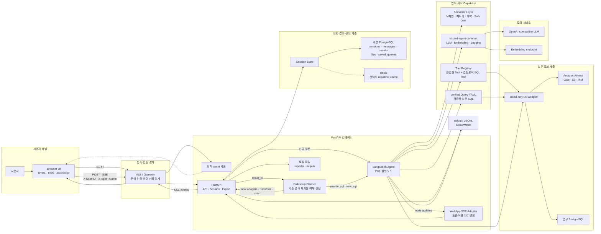
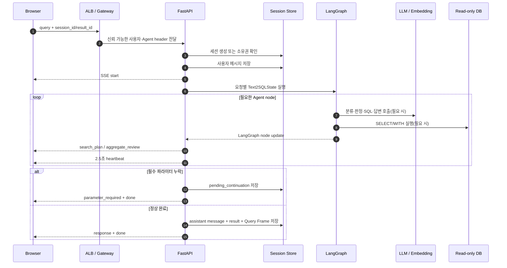
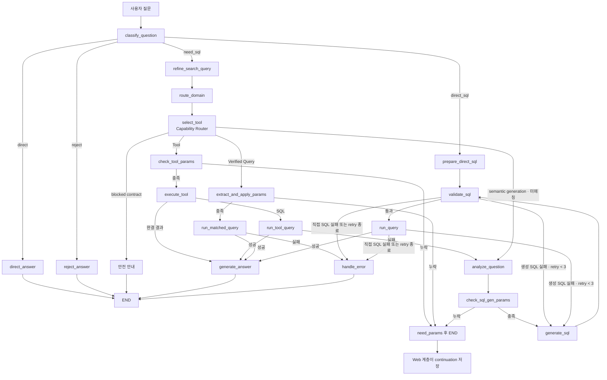
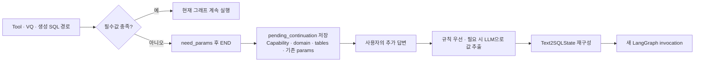
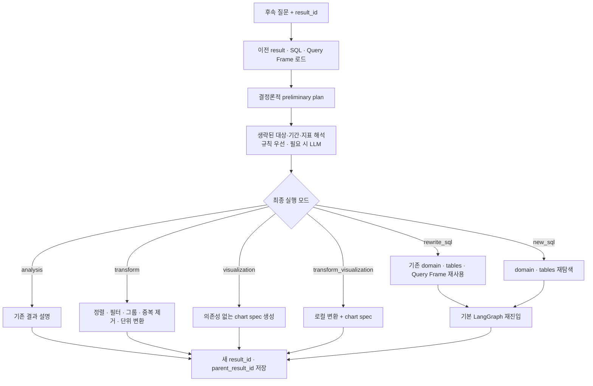
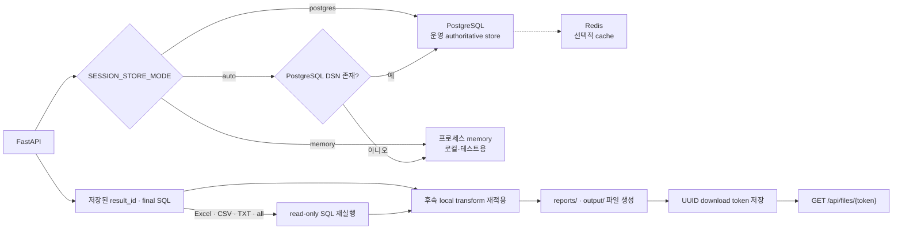
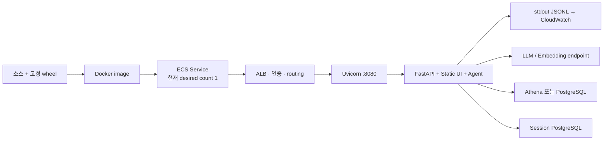

# Corporate Sales Text2SQL Agent · Architecture Flow

- 작성 기준: 2026-08-07 현재 작업 트리(As-Is)
- 대상: `corporate_sales_fable` Web UI, FastAPI, LangGraph Agent, Semantic Layer, 업무 조회 DB, 세션 저장소
- 목적: 실제 요청이 들어와 답변·후속 질문·파일 내보내기로 이어지는 흐름과 컴포넌트 책임을 한 문서에서 설명한다.

> 이 서비스는 **결정론적 규칙을 먼저 적용하고 필요한 구간에만 LLM을 사용하는 하이브리드 Text2SQL 시스템**이다. LangGraph는 요청 단위로 stateless하게 실행되고, 멀티턴 상태와 결과는 Web 계층의 Session Store가 관리한다.

## 1. 한눈에 보는 구조

| 구분 | 역할 |
|---|---|
| 사용자 채널 | 정적 HTML/CSS/JavaScript UI, JSON API, SSE 스트리밍 |
| API 계층 | 요청·헤더 검증, 세션 소유권 확인, Agent 실행, SSE 변환, 결과 저장 |
| Agent 계층 | 질문 분류, 도메인 라우팅, Capability 선택, SQL 생성·검증·실행, 답변 생성 |
| 지식 계층 | Semantic Layer, Verified Query, Tool registry, Safe Join, 업무 메트릭·용어 |
| 업무 데이터 계층 | PostgreSQL 또는 Amazon Athena를 통한 읽기 전용 조회 |
| 상태 계층 | PostgreSQL Session Store, 선택적 Redis cache, 개발용 memory store |
| 전달·운영 계층 | 후속 질문, 차트, Word/Excel/CSV/TXT export, 구조화 로그, health check |

주요 업무 범위는 다음 6개 canonical domain으로 나뉜다.

1. `merchant_sales`: 가맹점·브랜드·업종 매출
2. `card_usage`: 법인카드 국내·해외 이용
3. `corporate_sales_targeting`: 신규 영업 대상군
4. `customer_card_portfolio`: 고객·카드 포트폴리오
5. `credit_risk`: 한도·연체·대손·충당금
6. `relationship_sales_management`: 관리기업·관계영업 모니터링

## 2. 전체 아키텍처 Flow



### 컴포넌트별 책임

| 컴포넌트 | 책임 | 주요 구현 |
|---|---|---|
| Browser UI | 사용자 식별값·세션·`result_id` 전달, SSE 직접 파싱, 표·SQL·차트 렌더링 | `web/static/index.html` |
| FastAPI | API 계약, 세션 소유권, Agent 호출, continuation, export, health | `web_service.py` |
| WebApp adapter | 내부 node update를 `search_plan`, `aggregate_review`, `response` 이벤트로 집약 | `webapp_compatible_api/adapter.py` |
| LangGraph | 19개 node와 조건부 edge로 기본 Agent 실행 | `text2sql_agent/workflow.py` |
| Semantic Layer | 테이블·컬럼·메트릭·도메인·업무 계약·허용 JOIN의 SSOT | `semantic_layer.yaml`, `text2sql_agent/schema.py` |
| Capability | 완결형 계산 Tool, 결정론적 SQL Tool, Verified Query, 생성 SQL | `text2sql_agent/tools/` |
| DB adapter | 단일 read-only query 검증, PostgreSQL/Athena 실행, 행·시간 제한 | `text2sql_agent/db.py` |
| Session Store | 세션, 메시지, continuation, 결과, 파일 token, 저장 쿼리 | `text2sql_agent/session_store.py` |
| Follow-up | 기존 결과 로컬 처리와 SQL 재조회 사이의 선택 | `text2sql_agent/followup_ops.py`, `web_service.py` |
| Export | 저장 SQL 재실행, 로컬 변환 재적용, Word/Excel/CSV/TXT 생성 | `text2sql_agent/exports.py`, `web_service.py` |

## 3. HTTP · SSE 요청 Flow

주 API는 다음 두 endpoint다.

- `POST /api/v1/agent/{agent_name}/query/stream`: SSE 스트리밍
- `POST /api/v1/agent/{agent_name}/query`: JSON 응답

`/api/v1` 요청은 `X-User-ID`, `X-Agent-Name`을 요구하고, path·header·body의 agent 이름 일치 여부를 검증한다.



WebApp 호환 SSE의 정상 이벤트 순서는 아래와 같다.

```text
start → search_plan → aggregate_review → response → done
```

- 긴 실행 중에는 `heartbeat`가 추가된다.
- 실패 시 `error`가 추가될 수 있다.
- 응답 header의 `X-Stream-Request-ID`, `X-Stream-Message-ID`, `X-App-Release`로 브라우저 요청과 서버 로그를 연결한다.
- UI 진행 단계의 `match_verified_query`는 **표시용 가상 단계**다. 실제 LangGraph node가 아니며, VQ 매칭은 `select_tool` 내부에서 수행된다.

## 4. Agent Flow

### 4.1 전체 의사결정 흐름



### 4.2 질문 분류

분류는 결정론적 규칙을 먼저 적용하고 애매한 경우에만 LLM을 사용한다.

| 분류 | 조건과 처리 |
|---|---|
| `direct_sql` | 사용자가 `SELECT` 또는 `WITH` SQL을 직접 입력. 의미 재작성 없이 정적 검증 후 실행 |
| `direct` | 스키마·테이블·컬럼·업무 용어 질문. Semantic Layer를 바탕으로 SQL 없이 답변 |
| `reject` | 시스템 지원 범위 밖의 질문. 고정 안내 응답 |
| `need_sql` | 데이터 조회·집계 질문. 도메인과 Capability를 선택해 실행 |

명백한 데이터 질문은 규칙으로 `need_sql`이 되고, 나머지 애매한 문장만 LLM이 분류한다. LLM 응답 형식이 잘못된 경우 안전한 기본값은 `need_sql`이다.

### 4.3 검색 질의 정제와 도메인 라우팅

`refine_search_query`는 사용자 원문을 변경하지 않고 **검색·매칭용 질의만 별도로 만든다**. 정제 과정에서 원문에 없던 숫자나 조건을 새로 만들지 않도록 정규화한다.

`route_domain`은 다음 순서로 6개 domain 중 하나를 고른다.

1. 업무 규칙과 keyword 점수
2. canonical metric·entity 점수
3. 설정된 경우 embedding 유사도
4. 신뢰도가 낮거나 상위 후보 점수가 근접할 때만 LLM 최종 판정

### 4.4 Capability Router 우선순위

`select_tool`의 실제 선택 순서는 다음과 같다.

1. `blocked` Semantic Query Contract: 지원하지 않는 조합을 안전하게 종료
2. `semantic_generation` contract: 해당 계약을 고정해 생성 SQL 경로로 이동
3. Verified Query: contract 연결 → embedding → rule → 선택적 LLM fallback
4. 명확한 규칙으로 강제되는 deterministic Tool
5. 후보 Tool을 좁힌 뒤 필요한 경우 LLM 선택
6. 매칭 없음: 일반 생성 SQL 경로

| 실행 경로 | 적합한 상황 | 실패 처리 |
|---|---|---|
| 완결형 Tool | 복수 SQL·Python 계산·Excel 생성처럼 고정 업무 로직이 필요한 경우 | Tool 자체 오류 응답 |
| 결정론적 SQL Tool | 명확한 영업 CASE를 Python SQL builder로 재현할 수 있는 경우 | 조회 오류 시 일반 생성 경로로 전환 가능 |
| Verified Query | 검증된 업무 필터와 계산식이 가장 중요한 표준 질문 | DB 오류 시 생성 SQL로 대체하지 않음 |
| 생성 SQL | 표현이 다양하거나 기존 Capability에 없는 탐색형 질문 | 검증·실행 오류를 반영해 제한적으로 재생성 |
| 직접 SQL | 사용자가 작성한 SQL을 그대로 조회해야 하는 경우 | 자동 재작성하지 않고 오류 반환 |

Verified Query를 실패 후 생성 SQL로 바꾸지 않는 이유는, 검증된 업무 필터나 계산 규칙이 조용히 유실되는 것을 막기 위해서다.

### 4.5 자동 SQL 생성 컨텍스트

생성 SQL 경로는 전체 스키마를 무제한으로 넣지 않는다. 질문과 선택 domain에 관련된 범위로 줄인 다음 아래 정보를 전달한다.

- 선택 domain과 라우팅 근거
- 선택 테이블의 grain, 시간축, 질문 관련 컬럼
- canonical metric과 semantic attribute
- Semantic Query Contract
- 허용된 Safe Join path
- glossary와 query reference
- 가까운 SQL example
- 이전 Query Frame, 실패 SQL, 검증·DB 오류
- 사용자가 추가로 준 파라미터
- PostgreSQL 또는 Athena/Trino 방언 규칙

세부 프롬프트별 입력은 [prompt-context-flow.md](./prompt-context-flow.md)를 참고한다. 단, 수량 정보는 본 문서 작성 시점의 현재 코드가 우선한다.

### 4.6 SQL 검증·실행·답변

SQL은 두 겹으로 방어한다.

1. Semantic/static validation
   - 미등록·제한 테이블 차단
   - 미등록·민감·제한 컬럼 차단
   - `SELECT *` 차단
   - schema prefix, 필수 source table, 기간 의미, Semantic Contract 확인
2. DB 실행 직전 validation
   - 단일 `SELECT/WITH`만 허용
   - 다중 statement와 DML·DDL·위험 keyword 차단
   - PostgreSQL은 read-only session과 statement timeout 적용

일반 생성 SQL은 검증 오류와 DB 오류가 같은 `retry_count`를 사용하며 최대 3회 범위에서 오류를 반영해 다시 생성한다. 직접 SQL과 Verified Query는 자동 재작성하지 않는다.

답변 생성은 다음 fallback을 갖는다.

- 0행 결과: 결정론적 안내문
- 직접 SQL: LLM 없이 Markdown 표와 요약 생성
- 일반 결과: 최대 20행 preview와 계산 요약을 LLM에 전달
- 답변 LLM 실패: 결정론적 표·요약으로 fallback
- 사업자등록번호 등 업무 식별자는 답변 LLM 전달 전에 masking

## 5. 필수 파라미터와 Continuation Flow

기간, 대상, 관리기업 목록 같은 필수값이 없을 때 LangGraph를 suspend하지 않는다. 현재 실행은 `param_stage=need_params`로 종료되고 Web 계층이 이어서 실행할 정보를 세션에 저장한다.



즉, 이 흐름은 LangGraph checkpoint나 `interrupt()` 기반 재개가 아니다. Web Session Store를 이용한 애플리케이션 레벨 continuation이다. CLI도 값을 추가로 받은 뒤 새로운 state로 다시 호출한다.

관리기업 목록은 붙여넣기 또는 TXT/CSV/XLSX/XLSM으로 받을 수 있다. 서버 메모리에서 검증·중복 제거한 뒤 요청 범위 `VALUES` CTE로만 사용하며 임시·staging table에는 적재하지 않는다.

## 6. 후속 질문 Flow

후속 질문의 실제 연결 키는 `result_id`다. 요청 모델에 `conversation_history`가 선언되어 있지만, 현재 기본 state 구성에서는 이를 실행 문맥으로 소비하지 않는다.



기존 결과가 일부만 조회된 상태에서 상위 N, 전체 집계, 필터 같은 연산을 로컬로 수행하면 부정확할 수 있다. `result_scope`가 불완전하다고 판단하면 planner가 로컬 처리 대신 SQL 재실행으로 승격한다.

`Query Frame`에는 domain, tables, entity, 기간, metric, dimension, sort, limit, 결과 완전성, 재탐색 필요 여부가 구조화되어 저장된다.

## 7. 상태와 데이터 Flow

### 7.1 요청 단위 Agent State

`Text2SQLState`는 한 번의 그래프 실행에 필요한 값을 전달한다.

| 범주 | 주요 값 |
|---|---|
| 질문 문맥 | 원 질문, 검색용 질의, 질문 유형, 이전 질문·SQL·답변, follow-up 질문 |
| 라우팅 | domain, routing trace, 선택 Tool, matched VQ, 선택 table |
| 파라미터 | 추출값, 필수값, 누락값, `param_stage` |
| SQL | 생성 SQL, 최종 SQL, validation 결과, retry count, 오류 |
| 결과 | column, row, `result_scope`, answer, file path |
| 멀티턴 | `query_frame`, 후속 실행 정책 |

그래프 객체는 프로세스에서 한 번 compile해 재사용하지만 state와 실행은 요청별로 새로 만든다. LangGraph checkpointer는 사용하지 않는다.

### 7.2 업무 지식 Snapshot

| 지식 원천 | 2026-08-07 기준 규모 | 용도 |
|---|---:|---|
| Physical table | 31 | 허용 schema와 column context |
| Canonical domain | 6 | 업무 라우팅 |
| Semantic entity | 29 | grain·dimension·fact 구조 |
| Semantic attribute | 16 | 코드·값 의미와 source 정책 |
| Canonical metric | 29 | 공식·단위·필수 filter·집계 규칙 |
| Semantic Query Contract | 31 | intent별 source·shape·계산 정책 |
| Safe Join path | 37 | 허용 JOIN과 cardinality 주의사항 |
| Tool registry | 10 | 완결형 Python Tool 1개 + 결정론적 SQL Tool 9개 |
| Verified Query 정의 | 66 | 검증 SQL 원본 |
| 실행 가능 Verified Query | 53 | schema 호환 55개 중 `reference_only` 2개 제외 |

Verified Query가 Semantic Layer에 없는 물리 테이블을 참조하면 시작 시 비활성화되어 매칭·실행 대상에서 빠진다. 따라서 YAML 정의 수와 실제 실행 가능 수는 다르다.

### 7.3 업무 조회와 결과 범위

| 단계 | 기본 제한 |
|---|---:|
| 일반 DB 실행 | 최대 500행, 30초 |
| UI 저장·표시 | 최대 100행 |
| 답변 LLM preview | 최대 20행 |
| 데이터형 export 재조회 | 최대 1,000,000행, 300초 |
| Excel data row | 최대 1,048,575행 |
| 관리기업 업로드 | 파일 5MB, XLSX 압축 해제 50MB, 최대 5,000개 사업자번호 |

`result_scope`는 fetch limit 도달 여부와 결과 완전성을 기록한다. 화면 row 수와 원본 전체 row 수를 동일하게 가정하면 안 된다.

## 8. 세션·저장소·Export Flow



운영 PostgreSQL에는 다음 논리 테이블이 필요하다.

- `webapp_sessions`
- `webapp_messages`
- `webapp_results`
- `webapp_files`
- `webapp_saved_queries`

애플리케이션은 이 schema나 table을 자동 생성하지 않는다. Redis는 result/file token 조회를 빠르게 하는 best-effort cache이며 PostgreSQL이 원본이다.

기본 보존 경계는 사용자당 세션 50개, 세션당 메시지 80개, 결과·파일 7일, 세션 60일이다. 실제 삭제·정리는 `WEBAPP_POSTGRES_DELETE_ENABLED` 설정에 영향을 받는다.

## 9. 배포·관측 Flow



- LLM·embedding client는 프로세스당 singleton으로 생성해 재사용하고 FastAPI shutdown 시 닫는다.
- 설정 우선순위는 환경변수 override → common YAML/model registry → 기본값이다.
- PostgreSQL credential은 환경변수 또는 AWS Secrets Manager에서 읽는다.
- 로그는 request, trace, session, message ID를 연결하며 SQL 원문은 남기지 않는다.
- `/health`의 HTTP 200 또는 `ok: true`만으로 LLM 준비 상태를 판단하지 말고 `llm_ready`를 별도로 확인한다.
- 폐쇄망 Athena 실행에는 Athena뿐 아니라 Glue, S3 query result, STS/IAM 경로도 필요하다.

## 10. 보안·신뢰 경계

| 경계 | 현재 동작 | 운영 의미 |
|---|---|---|
| 사용자 인증 | 애플리케이션 자체 JWT/login middleware 없음 | ALB/API Gateway가 `X-User-ID`를 신뢰 가능한 값으로 덮어써야 함 |
| 세션·결과 소유권 | `user_id` 조건으로 세션·결과·저장 쿼리 격리 | legacy API의 기본 사용자값 사용 여부를 운영에서 통제해야 함 |
| SQL | 단일 read-only `SELECT/WITH`만 허용 | Semantic 검증과 함께 사용하되 DB 권한 자체도 read-only여야 함 |
| 민감 데이터 | 제한 table/column을 prompt·검증 경로에서 제외, 식별자 masking | 별도 데이터 접근통제를 대체하지 않음 |
| 관리기업 업로드 | 형식·용량·개수 검증 후 요청 범위 CTE 사용 | 원본 목록을 메시지에 저장하지 않고 건수만 기록 |
| 다운로드 | UUID token을 아는 요청자에게 파일 제공 | token이 bearer capability이므로 URL 유출 방지 필요 |

## 11. 현재 구현의 중요한 제약

1. **Agent cancel/checkpoint 없음**

   브라우저가 SSE 연결을 끊어도 daemon worker가 실행 중인 graph를 즉시 중단한다는 보장이 없다. 장시간 작업의 명시적 취소와 중간 node 재개는 현재 범위 밖이다.

2. **멀티턴의 기준은 `conversation_history`가 아니라 `result_id`**

   후속 질문은 저장된 result와 Query Frame을 사용한다. 누락 파라미터 재개는 별도의 `pending_continuation`을 사용한다.

3. **Export 파일은 컨테이너 로컬 저장**

   세션 DB에 token record가 남아도 ECS task 교체나 다중 replica 환경에서 실제 파일이 없을 수 있다. 공유 object storage 없이 수평 확장하면 다운로드 일관성이 깨질 수 있다.

4. **다운로드는 token 기반**

   `/api/files/{token}`은 현재 사용자 header를 다시 대조하는 대신 UUID token 자체를 권한으로 사용한다.

5. **운영 인증은 외부 책임**

   브라우저가 보내는 `X-User-ID`를 애플리케이션이 자체 인증하지 않는다. 신뢰 경계 앞단에서 header 주입·위변조 차단이 필요하다.

6. **현재 Docker process는 root user**

   운영 hardening 시 non-root 실행 가능 여부를 별도 검토해야 한다.

## 12. 오프라인 검증 Snapshot

현재 작업 트리에서 외부 DB·LLM 없이 확인한 결과는 다음과 같다.

- `pytest -q -p no:cacheprovider`: 409 passed
- 품질 계약 평가: 40/40
- Semantic golden set: 1,000/1,000

이 결과는 코드·Semantic Layer의 오프라인 자기일관성 검증이다. 저장된 live 평가에서는 전체 1,000건 중 1건만 시도되었고 해당 요청도 모델 timeout이었으므로, **실제 LLM·DB End-to-End 검증 완료를 의미하지 않는다.**

## 13. 주요 소스 맵

| 관심사 | 소스 |
|---|---|
| API, SSE, 세션 연결, follow-up, export | [`web_service.py`](../web_service.py) |
| LangGraph node와 edge | [`text2sql_agent/workflow.py`](../text2sql_agent/workflow.py) |
| Agent state 계약 | [`text2sql_agent/state.py`](../text2sql_agent/state.py) |
| Semantic schema와 SQL 검증 | [`text2sql_agent/schema.py`](../text2sql_agent/schema.py) |
| Semantic Layer SSOT | [`semantic_layer.yaml`](../semantic_layer.yaml) |
| Verified Query SSOT | [`text2sql_agent/tools/sql_verified_queries.yaml`](../text2sql_agent/tools/sql_verified_queries.yaml) |
| Tool registry와 SQL builder | [`text2sql_agent/tools/registry.py`](../text2sql_agent/tools/registry.py), [`text2sql_agent/tools/sql_builders.py`](../text2sql_agent/tools/sql_builders.py) |
| DB 안전성·실행 | [`text2sql_agent/db.py`](../text2sql_agent/db.py) |
| Session Store | [`text2sql_agent/session_store.py`](../text2sql_agent/session_store.py) |
| Follow-up 연산 | [`text2sql_agent/followup_ops.py`](../text2sql_agent/followup_ops.py) |
| Query Frame과 result scope | [`text2sql_agent/query_frame.py`](../text2sql_agent/query_frame.py) |
| LLM·embedding adapter | [`text2sql_agent/llm.py`](../text2sql_agent/llm.py) |
| WebApp SSE 계약 | [`webapp_compatible_api/adapter.py`](../webapp_compatible_api/adapter.py), [`WEBAPP_COMPATIBLE_API_SPEC.md`](../webapp_compatible_api/WEBAPP_COMPATIBLE_API_SPEC.md) |
| UI | [`web/static/index.html`](../web/static/index.html) |
| 배포 | [`Dockerfile`](../Dockerfile), [`aic-deploy.env`](../aic-deploy.env) |

관련 세부 문서:

- [프롬프트 컨텍스트와 데이터 출처](./prompt-context-flow.md)
- [설정 흐름](./configuration-flow.md)
- [SSE · ECS 트러블슈팅](./sse-ecs-troubleshooting.md)
- [Semantic golden set](./semantic-golden-set.md)

기존 문서에는 이전 시점의 수량이나 단순화된 구조가 일부 남아 있다. Agent와 Architecture의 현재 As-Is 기준은 이 문서와 실제 코드의 graph·schema 정의를 우선한다.
