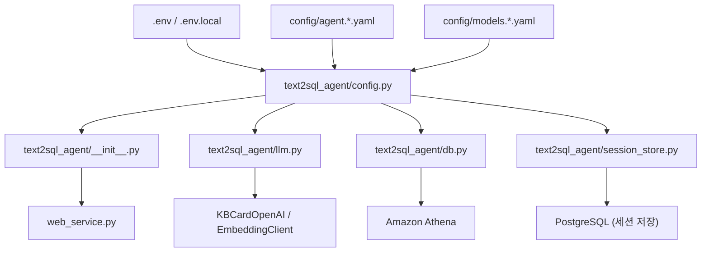

# Configuration Flow

이 문서는 이 서비스가 `kbcard-agent-common` 예제 방식의 설정을 읽고 LLM, embedding,
Amazon Athena(업무 조회)·PostgreSQL(세션 저장) 쪽으로 넘기는 흐름만 정리합니다.

## 전체 흐름



설정의 중심은 `text2sql_agent/config.py`입니다. import 시점에 `.env`, `.env.local`,
common YAML, 환경 변수를 읽어서 기존 서비스 코드가 쓰는 `VLLM_*` 호환 상수로 노출합니다.

## 설정 파일

### `.env.example`

실행 환경에서 필요한 secret과 common config 경로의 예시입니다.

- `KBCARD_CONFIG_PATH`: common agent YAML 경로입니다.
- `LLM_API_KEY`: 로컬 vLLM처럼 인증이 없을 때 `EMPTY`로 둡니다.
- `KBCARD_POSTGRES_DSN`: 세션 저장용 PostgreSQL DSN secret입니다.

### `config/agent.example.yaml`

common의 agent 설정 파일입니다.

- `agent`: agent 이름, 실행 환경, service name입니다.
- `llm`: model registry 경로, 기본 모델, temperature, max tokens, timeout입니다.
- `embedding`: TEI embedding endpoint, 모델명, timeout입니다.

### `config/models.example.yaml`

LLM model registry입니다. `agent.example.yaml`의 `llm.default_model`이 여기의 key를 가리킵니다.
secret은 YAML에 직접 쓰지 않고 `api_key_env`로 환경 변수 이름만 연결합니다.

```yaml
models:
  local-chat:
    provider: vllm
    base_url: http://127.0.0.1:8000
    endpoint_path: /v1/chat/completions
    api_key_env: LLM_API_KEY
    timeout: 120
```

## `text2sql_agent/config.py`

우선순위는 "환경 변수 override -> common YAML/model registry -> 코드 기본값"입니다.

- `COMMON_CONFIG_PATH`: `KBCARD_CONFIG_PATH`, `KBCARD_AGENT_CONFIG_PATH`, `AGENT_CONFIG_PATH`를
  차례로 확인하고, 없으면 `config/agent.local.yaml`을 씁니다.
- `COMMON_CONFIG`: `KBCardConfig.from_yaml(...)`로 읽은 agent 설정 객체입니다.
- LLM 모델 endpoint는 `llm.model_registry_path`의 `ModelRegistry`에서 `llm.default_model`로 조회합니다.
- 위 값들을 평탄한 상수(`LLM_MODEL`, `LLM_BASE_URL`, `LLM_ENDPOINT_PATH`, `LLM_PROVIDER`,
  `LLM_API_KEY`, `LLM_TEMPERATURE`, `LLM_MAX_TOKENS`, `LLM_TIMEOUT`, `EMBED_*`, `DB_*`)로 노출합니다.
  같은 이름의 환경 변수가 있으면 그 값이 YAML보다 우선합니다.

## `text2sql_agent/llm.py`

LLM과 embedding 호출은 모두 `kbcard-agent-common`의 OpenAI 호환 클라이언트를 단일 경로로 사용합니다.
별도의 raw `requests` 폴백이나 Bedrock converse 경로는 없습니다.

LLM client는 한 번만 만들어 재사용합니다.

1. common YAML(`llm` 섹션)이 있으면 `KBCardOpenAI.from_config(COMMON_CONFIG, default_model=LLM_MODEL)`.
2. 없으면 `KBCardOpenAI.from_endpoint(base_url=, default_model=, api_key=, endpoint_path=, timeout=)`.

embedding client도 같은 패턴입니다.

1. common YAML(`embedding` 섹션)이 있으면 `EmbeddingClient.from_config(COMMON_CONFIG)`.
2. 없으면 `TEIEmbeddingClient(base_url=, model=, api_key=, timeout=)`.

`_call_llm`은 system/user 두 메시지(역할 분리)로 호출하고, `RetryableProviderError`(타임아웃·일시
오류·5xx)는 짧은 backoff로 자동 재시도합니다. `probe_llm`은 `/health`에서 쓰는 1-token readiness
probe입니다. 그 외 surface는 `_normalize_llm_text`, `_get_embedding`, `_get_embeddings_batch`,
`_cosine_similarity`입니다.

## `text2sql_agent/common_services.py`

webservice가 기존 함수명을 유지할 수 있도록 만든 로컬 adapter입니다.

- `create_trace_context(...)`: 로컬 `TraceContext`를 만듭니다.
- `observability_context(...)`: no-op context manager를 반환합니다.
- `emit_execution_log(...)`, `emit_module_event(...)`: common observability를 사용하지 않으므로 no-op입니다.
- `common_http_status(...)`: common LLM/embedding provider error 이름을 API HTTP status로 매핑합니다.

## 로컬 실행 예시

```bash
cp config/agent.example.yaml config/agent.local.yaml
cp config/models.example.yaml config/models.local.yaml
```

`.env.local`:

```bash
KBCARD_CONFIG_PATH=config/agent.local.yaml
LLM_API_KEY=EMPTY
KBCARD_POSTGRES_DSN="host=127.0.0.1 port=5432 dbname=postgres user=postgres password=your-password"
```

`agent.local.yaml`에서 `llm.model_registry_path`를 `models.local.yaml`로 바꾸면 로컬 전용 endpoint를
Git에 올리지 않고 사용할 수 있습니다.
