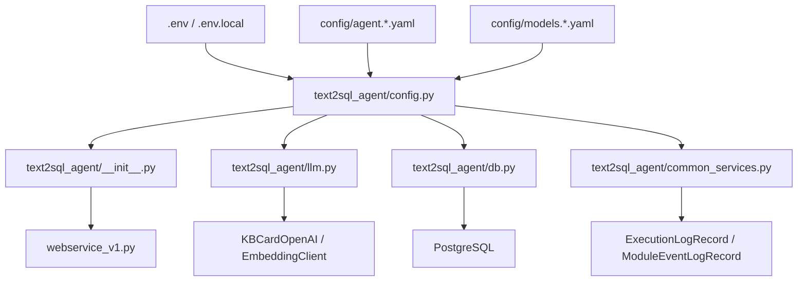

# Configuration Flow

이 문서는 이 서비스가 `kbcard-agent-common` 방식의 설정을 읽고 LLM, embedding, PostgreSQL,
observability 쪽으로 넘기는 흐름만 정리합니다.

## 전체 흐름



설정의 중심은 `text2sql_agent/config.py`입니다. import 시점에 `.env`, `.env.local`,
common YAML, 환경 변수를 읽어서 기존 서비스 코드가 쓰는 `VLLM_*` 호환 상수로 노출합니다.

## 설정 파일

### `.env.example`

실행 환경에서 필요한 secret과 common config 경로의 예시입니다.

- `KBCARD_CONFIG_PATH`: common agent YAML 경로입니다.
- `LLM_API_KEY`: 로컬 vLLM처럼 인증이 없을 때 `EMPTY`로 둡니다.
- `KBCARD_POSTGRES_DSN`: common 예제 방식의 PostgreSQL DSN secret입니다.
- `KBCARD_LOG_*`: common observability 로그 설정입니다.

### `config/agent.example.yaml`

common의 agent 설정 파일입니다.

- `agent`: agent 이름, 실행 환경, service name입니다.
- `llm`: model registry 경로, 기본 모델, temperature, max tokens, timeout입니다.
- `embedding`: TEI embedding endpoint, 모델명, timeout입니다.
- `retrieval.store`: PostgreSQL DSN을 읽을 환경 변수 이름입니다.

### `config/models.example.yaml`

LLM model registry입니다. `agent.example.yaml`의 `llm.default_model`이 여기의 key를 가리킵니다.
secret은 YAML에 직접 쓰지 않고 `api_key_env`로 환경 변수 이름만 연결합니다.

```yaml
models:
  local-chat:
    provider: vllm
    base_url: http://127.0.0.1:8000
    endpoint_path: /v1/chat/completions
    api_key_env: LLM_API_KEY
    timeout: 120
```

## `text2sql_agent/config.py`

우선순위는 "환경 변수 override -> common YAML/model registry -> 코드 기본값"입니다.

- `COMMON_CONFIG_PATH`: `KBCARD_CONFIG_PATH`, `KBCARD_AGENT_CONFIG_PATH`, `AGENT_CONFIG_PATH`를 차례로 확인합니다.
- `COMMON_CONFIG`: common SDK가 설치되어 있고 YAML이 있으면 `KBCardConfig.from_yaml(...)`로 읽습니다.
- `COMMON_LLM_SETTINGS`: `COMMON_CONFIG.get_llm_settings()` 결과입니다.
- `COMMON_LLM_MODEL_CONFIG`: `llm.model_registry_path`를 읽고 `llm.default_model`에 해당하는 모델 설정을 찾습니다.
- `COMMON_EMBEDDING_SETTINGS`: `COMMON_CONFIG.require_embedding()` 결과입니다.
- `COMMON_RETRIEVAL_STORE`: `retrieval.store` 설정입니다.

기존 코드와 호환되도록 아래 alias를 유지합니다.

```python
VLLM_BASE_URL = LLM_BASE_URL
VLLM_MODEL = LLM_MODEL
VLLM_API_KEY = LLM_API_KEY
VLLM_ENDPOINT_PATH = LLM_ENDPOINT_PATH
VLLM_PROVIDER = LLM_PROVIDER
VLLM_TEMPERATURE = LLM_TEMPERATURE
VLLM_MAX_TOKENS = LLM_MAX_TOKENS
VLLM_TIMEOUT = LLM_TIMEOUT
```

## `text2sql_agent/llm.py`

LLM 호출은 common SDK를 우선 사용합니다.

1. common YAML이 있으면 `KBCardOpenAI.from_config(COMMON_CONFIG, default_model=VLLM_MODEL)`를 사용합니다.
2. YAML이 없지만 common SDK가 설치되어 있으면 `KBCardOpenAI.from_endpoint(...)`를 사용합니다.
3. common SDK가 없는 개발 환경에서는 기존 `requests` 호출로 `/v1/chat/completions` 호환 endpoint에 폴백합니다.

embedding도 같은 패턴입니다.

1. common YAML이 있으면 `EmbeddingClient.from_config(COMMON_CONFIG)`를 사용합니다.
2. YAML이 없지만 common SDK가 설치되어 있으면 `TEIEmbeddingClient(...)`를 사용합니다.
3. common SDK가 없는 개발 환경에서는 기존 `requests` 호출로 `/v1/embeddings`에 폴백합니다.

## `text2sql_agent/common_services.py`

common observability와 error 타입을 서비스 코드가 직접 의존하지 않도록 감싼 adapter입니다.

- `create_trace_context(...)`: common `TraceContext`를 만듭니다.
- `observability_context(...)`: 요청 처리 중 common logging context를 엽니다.
- `emit_execution_log(...)`: 요청 단위 실행 로그를 남깁니다.
- `emit_module_event(...)`: DB 조회 같은 모듈 단위 이벤트를 남깁니다.
- `common_http_status(...)`: common error를 API HTTP status로 매핑합니다.

## 로컬 실행 예시

```bash
cp config/agent.example.yaml config/agent.local.yaml
cp config/models.example.yaml config/models.local.yaml
```

`.env.local`:

```bash
KBCARD_CONFIG_PATH=config/agent.local.yaml
LLM_API_KEY=EMPTY
KBCARD_POSTGRES_DSN="host=127.0.0.1 port=5432 dbname=postgres user=postgres password=your-password"
```

`agent.local.yaml`에서 `llm.model_registry_path`를 `models.local.yaml`로 바꾸면 로컬 전용 endpoint를
Git에 올리지 않고 사용할 수 있습니다.
