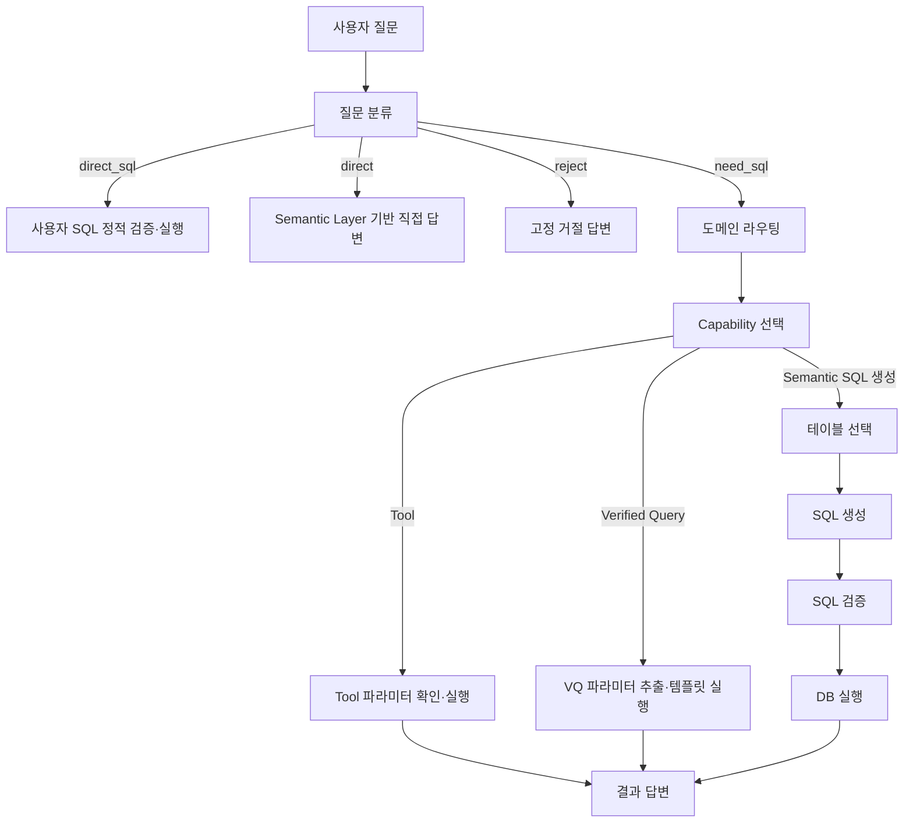

# 프로세스별 프롬프트 컨텍스트와 데이터 출처

- 작성 기준일: 2026-08-04
- 대상: `text2sql_agent` LangGraph, `web_service.py` 후속 처리, 대손비용률 Tool

## 1. 목적과 범위

이 문서는 각 LLM 프롬프트가 다음 원천에서 어떤 정보를 가져오는지 정리한다.

- `semantic_layer.yaml`
- `text2sql_agent/tools/sql_verified_queries.yaml`
- Tool registry와 실행 시점 설정
- 사용자 질문, 이전 대화, SQL 검증 결과, DB 조회 결과

문서에서 **직접 주입**은 정보가 실제 프롬프트 문자열에 포함되는 경우를 뜻한다. **간접 사용**은 라우팅, 후보 선별, 파라미터 확정처럼 프롬프트 호출 전후의 결정론적 로직에서만 사용하는 경우를 뜻한다.

운영 readiness 확인용 `ping`은 업무 프롬프트가 아니므로 제외한다. 업무용 LLM 프롬프트는 총 15개다.

- LangGraph 핵심 흐름: 10개 (`workflow.py` 9개, `schema.py` 1개)
- 대손비용률 Tool: 1개
- Web 누락 파라미터·후속 처리: 4개

모든 LLM 호출에는 다음 공통 system prompt가 붙는다.

> KB카드 법인영업 데이터베이스를 다루는 한국어 데이터 분석 어시스턴트로서, 주어진 스키마·메트릭·규칙과 요청 출력 형식을 준수한다.

공통 system prompt 자체에는 semantic layer나 Verified Query의 동적 정보가 들어가지 않는다.

## 2. 전체 처리 흐름



주요 분기 특성은 다음과 같다.

- 사용자 직접 SQL은 LLM 분류·검증·답변을 우회하고 정적 검증, DB 실행, 결정론적 결과 표를 사용한다.
- `reject`는 고정 답변이며 별도 LLM 프롬프트가 없다.
- Verified Query 실행 오류는 일반 SQL 생성으로 대체하지 않고 오류 처리한다.
- 일반 생성 SQL의 검증·실행 오류는 최대 3회까지 SQL 생성 단계로 돌아간다.

## 3. 데이터 원천

### 3.1 Semantic Layer

작성 시점의 `semantic_layer.yaml` 구성은 다음과 같다.

| 구분 | 수량 | 프롬프트에서 사용하는 주요 정보 |
|---|---:|---|
| `tables` | 31 | 물리·논리 테이블명, 설명, grain, PK, 컬럼, 시간축, 집계 정책, partition, filter |
| `canonical_domains` | 6 | 업무 범위, keywords, 기본 fact/time/filter, primary entity, preferred metric |
| `semantic_entities` | 29 | 물리 테이블, grain, canonical dimension/fact, 사용 조건 |
| `semantic_attributes` | 17 | 업무 속성, 별칭, 코드북, 값 의미, 테이블·컬럼 매핑, 현재/과거 원천 정책 |
| `canonical_metrics` | 42 | 공식, 원천, 시간축, 단위, 필수 필터, 집계 방식, 분자·분모, grain |
| `semantic_query_contracts` | 37 | intent 조합, 실행 모드, source table, SQL shape, 기간·필터·계산 정책 |
| `semantic_join_graph.safe_paths` | 38 | 허용 JOIN 조건, join type, 사용 조건, 주의사항 |
| `glossary` | 23 | 용어, 별칭, 표준 의미, 설명, SQL hint |
| `query_references` | 20 | 기준 질문, primary/join table, join rule, 추천 컬럼, SQL pattern, lineage |

`semantic_layer_metadata`의 버전, 원천 문서 목록, source limitation은 로드되지만 현재 업무 프롬프트 builder가 직접 직렬화하지 않는다.

### 3.2 Verified Query

Verified Query의 런타임 SSOT는 `text2sql_agent/tools/sql_verified_queries.yaml`이다. 공통 필드는 다음과 같다.

- `name`
- `question`
- `description`
- `sql` 또는 `sql_builder`
- `parameters`: `type`, `description`, `required`, `default`, `sample_values`
- `tags`
- 선택적 `runtime_mode`

작성 시점의 로드 결과는 다음과 같다.

| 상태 | 수량 |
|---|---:|
| YAML 정의 전체 | 65 |
| Semantic schema의 물리 테이블과 호환 | 54 |
| 미등록 테이블 참조로 비활성화 | 11 |
| 호환 목록 중 `reference_only` | 2 |
| 실제 매칭·실행 가능 | 52 |

`sql_builder` 항목은 로드 시 Python builder가 SQL 템플릿으로 변환한다. 외부 VQ SQL에서 현재 semantic schema에 없는 `FROM/JOIN` 테이블을 참조하면 `disabled_verified_queries`로 분리되어 매칭·실행 대상에서 제외된다.

### 3.3 실행·세션 상태

프롬프트는 semantic/VQ 외에도 다음 상태를 사용한다.

- 현재 사용자 질문과 추가 파라미터
- 선택 도메인, 도메인 후보 점수와 라우팅 근거
- 선택 테이블과 질문 관련 컬럼 상세
- 이전 질문·SQL·답변과 실제 후속 질문
- 구조화된 `query_frame`
- 이전 SQL 검증 또는 DB 실행 오류
- 실제 실행 SQL, 컬럼, 결과 행, 결과 범위
- 실행일 기준 현재월·지난달

## 4. LangGraph 핵심 프롬프트별 입력

| 번호 | 프로세스·프롬프트 | 호출 조건 | Semantic Layer 직접 주입 | Verified Query 직접 주입 | 기타 입력·간접 사용 |
|---:|---|---|---|---|---|
| 1 | `classify_question` 질문 분류 | 직접 SQL, schema 질문, 명백한 집계 질문 규칙에 걸리지 않을 때 | 모든 domain의 `name`, `business_scope`, 상위 8개 `keywords`; glossary의 `term` 목록 | 없음 | 사용자 질문과 고정 분류 기준. 테이블·metric 공식은 미포함 |
| 2 | `_adjudicate_domain_with_llm` 도메인 최종 판정 | 규칙·metric/entity·embedding 점수가 낮거나 상위 후보가 근접할 때 | 상위 3개 domain의 이름, 계산 점수, `business_scope`, `keywords`, `preferred_metrics` | 없음 | 후보 점수 계산에는 domain, metric, entity와 선택적 embedding을 간접 사용 |
| 3 | `_extract_tool_selection_with_llm` Tool 선택·파라미터 추출 | 태그로 좁힌 Tool 후보가 있을 때 | 선택 domain context와 전체 `sql_generation_contract` | 실제 VQ SQL 없음 | Tool registry의 이름·설명·파라미터·필수 여부, 현재 날짜, 질문 |
| 4 | `_match_vq_by_llm` VQ fallback 매칭 | contract·embedding·lexical 매칭이 실패하고 `ENABLE_VERIFIED_QUERY_LLM_FALLBACK=true`일 때 | 없음 | 최대 8개 후보의 `question`, `tags`, 파라미터 이름 | 후보 랭킹에는 `name`, `question`, `description`, `tags`를 간접 사용. SQL과 description은 프롬프트에 미포함 |
| 5 | `extract_and_apply_params` VQ 파라미터 추출 | VQ가 매칭됐을 때 | 프롬프트에는 없음 | VQ YAML의 `parameters`와 코드의 `VQ_PARAM_SPECS`를 합친 파라미터 명세 | 현재 날짜·기간 규칙, 질문. 결정론적 추출기는 `semantic_attributes.value_semantics`를 간접 사용하며 VQ SQL 본문은 프롬프트에 미포함 |
| 6 | `direct_answer` SQL 없는 직접 답변 | 용어·테이블·컬럼·스키마 질문 | 관련 테이블 요약/상세, glossary, attributes, metrics, 전역 contract, query references | 실제 VQ SQL 없음. query reference에 연결 VQ 이름은 포함될 수 있음 | 사용자 질문 |
| 7 | `analyze_question` 테이블 선택 | Tool/VQ가 선택되지 않은 생성 SQL 경로 | domain context·trace, 전역 contract, safe joins, 규칙 후보, table catalog, glossary, attributes, metrics, query contracts, references | 없음 | `table_selection_mode=authoritative` 계약은 이 프롬프트를 생략하고 source table을 직접 선택 |
| 8 | `generate_sql` SQL 생성 | 일반 생성 SQL 경로와 재시도·SQL 후속질문 | domain context·trace, 전역 contract, 선택 테이블 상세, safe joins, metrics, attributes, query contracts, glossary, references | 질문·도메인과 가까운 executable VQ 최대 1개의 `Q + 전체 SQL` | 멀티턴 상태, 이전 실패와 SQL, 사용자 추가값, DB 방언, 날짜 규칙, 질문 |
| 9 | `validate_sql` SQL 의미 검증 | 정적 schema·안전성 검증을 통과한 자동 생성 SQL | 관련 metric 정의와 semantic query contract | 없음 | 질문, SQL, 사용 테이블, 현재월·지난달·이름 검색 규칙. 정적 이슈 또는 사용자 직접 SQL은 프롬프트 생략 |
| 10 | `generate_answer` 결과 답변 | 결과가 있고 기존 Tool 답변 또는 직접 SQL 경로가 아닐 때 | semantic layer를 다시 조회하지 않음 | VQ catalog를 다시 조회하지 않음. VQ 경로이면 실제 실행된 VQ SQL과 `검증된 쿼리: 이름`이 간접 전달됨 | 질문, 실제 SQL, 최대 20행, 합계·평균·최소·최대·주요값, 기준시점. 사업자번호 마스킹 |

## 5. Semantic context builder별 제공 범위

### 5.1 Domain context

`build_domain_context`는 다음 정보를 전달한다.

- 선택 domain과 업무 범위
- 기본 fact table과 time dimension
- 기본 필터
- primary entity의 논리·한글명, 물리 테이블, grain
- 최대 8개 metric의 expression, source table, time dimension, required filter, synonym

### 5.2 Metric summary

`build_metrics_summary`는 질문·도메인 관련 metric을 최대 8개 선별해 다음을 전달한다.

- 업무 정의와 SQL expression
- source table, time dimension, unit
- required filters와 aggregation behavior
- result grain
- window, numerator, denominator expression
- time policy, name filter, semantic caution, support status

### 5.3 Semantic attribute summary

`build_semantic_attributes_summary`는 질문 관련 attribute를 최대 6개 전달한다.

- 업무 정의, aliases, parameter name
- codebook status, provenance, validity
- current/period source selection 정책
- source table, columns, role
- value semantics와 filter expression
- semantic cautions

질문에 직접 매칭되지 않더라도 선택된 semantic query contract에 attribute가 명시되어 있으면 우선 포함한다.

### 5.4 Semantic query contract

질문과 일치하는 contract를 최대 2개 전달한다.

- `execution_mode`, `reference_query`
- source tables와 current/period source policy
- `require_all_selected_tables`, SQL shape
- canonical metrics, grain, dimensions, attributes
- entity binding, name filter, time policy
- deduplication, filters, calculation, result fields
- ambiguity policy와 support status

### 5.5 Safe join context

도메인·질문·선택 테이블과 관련된 safe path를 SQL 생성 단계에서 최대 5개 전달한다.

- from/to entity와 물리 테이블
- join type과 실제 join SQL
- `use_when`
- cardinality 또는 중복 관련 caution

### 5.6 Query reference

질문과 가까운 reference를 최대 2개 전달한다.

- intent와 기준 사용자 표현
- primary table과 join tables
- join rule
- 연결 Verified Query 이름
- source lineage
- 추천 컬럼과 required parameters
- 업무 규칙과 SQL pattern

`query_references[].verified_query`는 실행 지시가 아니라 lineage·hint다.

### 5.7 Table detail

선택 테이블에 대해서만 다음 정보를 전달한다.

- 목적, table kind, grain, PK, source definition
- primary time dimension
- snapshot·aggregation·deduplication 정책
- 질문 관련 컬럼의 타입, 설명, 집계, 단위, format, 시간 역할
- codebook과 value semantics/provenance
- Athena partition과 table filter
- 선택 테이블 사이의 safe join

일반 기본값은 테이블당 최대 16개, 전체 최대 48개 컬럼이다. 스키마 직접 설명 질문은 테이블당 최대 24개를 허용하되 전체 최대값은 48개로 유지한다.

## 6. Verified Query의 두 가지 사용 방식

### 6.1 매칭 후 직접 실행

Verified Query 선택 순서는 다음과 같다.

1. Semantic Query Contract의 `verified_query` 연결
2. VQ embedding 유사도
3. `name`, `question`, `description`, `tags` lexical 점수
4. 설정된 경우에만 LLM fallback

Semantic Query Contract 매칭은 다음 semantic 정보를 사용한다.

- `match.required`, `optional`, `excluded`
- 명시 기간 필요·제외 조건
- 필수 semantic attribute 값
- examples
- 연결할 `verified_query` 이름
- entity binding과 required parameter

후보가 선택된 뒤의 intent guard는 VQ의 `name`, `question`, `description`, `tags`, `sql`을 함께 확인하고, 연결된 semantic query contract와 필수 entity binding이 현재 질문에 맞는지 다시 검사한다. 이 정보는 매칭 검증에만 사용되며 별도 LLM 프롬프트에는 들어가지 않는다.

매칭 후 상태에 다음 값을 복사한다.

- `matched_query_name`
- `matched_query_sql`
- `matched_query_params`

이후 흐름은 다음과 같다.

```text
VQ 선택
→ VQ 파라미터 추출 프롬프트
→ 결정론적 규칙값과 사용자 추가값 병합
→ 저장된 SQL 템플릿에 값 적용
→ DB 직접 실행
→ 결과 답변
```

파라미터 병합 우선순위는 다음과 같다.

```text
LLM 추출값 < 결정론적 규칙·semantic attribute 추출값 < 사용자 추가 입력값
```

필수 시간 파라미터는 YAML에 정적 default가 있더라도 질문, 상대 날짜 규칙 또는 사용자 continuation에서 확보하지 못하면 추가 입력을 요청한다. 숫자·목록·사업자번호 타입을 검증하고 해결되지 않은 placeholder가 남으면 실행하지 않는다.

이 경로는 일반 `generate_sql`과 `validate_sql` LLM 프롬프트를 거치지 않는다. DB 실행이 실패해도 VQ를 일반 생성 SQL로 교체하지 않는다.

### 6.2 자동 SQL 생성용 참고 예시

VQ가 직접 매칭되지 않은 일반 SQL 생성에서는 `find_relevant_queries`가 질문·도메인과 가까운 executable VQ를 최대 1개 선택한다.

관련성 계산에는 다음 VQ 필드를 사용한다.

- `name`
- `question`
- `description`
- `tags`
- `parameters`
- SQL에서 추출한 사용 테이블

SQL 생성 프롬프트에는 다음 형태만 주입한다.

```text
Q: 검증된 기준 질문
SQL:
검증된 SQL 예시
```

이 SQL은 직접 실행 대상이 아니다. LLM은 semantic table, metric, attribute, contract, join, reference와 함께 새 SQL을 작성하고 일반 검증 단계를 거친다.

### 6.3 `reference_only`

작성 시점의 `reference_only` VQ는 다음 두 개다.

- `corporate_card_churned_after_usage_members`
- `corporate_limit_low_utilization_members`

이 항목은 다음 대상에서 제외된다.

- 직접 실행 매칭
- lexical 및 LLM 후보
- SQL 생성 프롬프트의 참고 SQL 예시

대신 semantic query contract의 source table, metric, filter, calculation 정책을 사용하는 `semantic_generation` 경로로 보낸다.

## 7. Tool과 Web 추가 프롬프트

Tool 선택 프롬프트에는 registry의 Tool 설명과 파라미터 명세만 들어간다. 일부 SQL Tool이 내부적으로 VQ 이름 또는 결정론적 SQL builder에 연결되어 있더라도, 해당 SQL 템플릿은 Tool 선택 프롬프트에 노출되지 않는다.

| 번호 | 프로세스·프롬프트 | 직접 전달 정보 | Semantic Layer·VQ 관계 |
|---:|---|---|---|
| 11 | 대손비용률 Tool 결과 요약 | 가맹점명, 기준월·전월, LS·IS, 대손비용·보정 공식, 월초·월말 충당금·상각·종합 결과를 시트별 최대 20행 | 직접 사용 없음. Tool 내부 계산과 DB 결과 사용 |
| 12 | 누락 파라미터 자연어 해석 | 원 질문, 누락 파라미터 metadata, 사용자 추가 답변, 현재 날짜 규칙 | semantic/VQ 직접 조회 없음. 누락 metadata가 Tool 또는 VQ에서 유래할 수 있음 |
| 13 | 후속 질문 추천 | 원 질문, 기존 답변 최대 1,200자, 결과 컬럼, 제한된 결과 미리보기 | 직접 사용 없음. 기본 설정은 `static`이므로 LLM 추천은 opt-in |
| 14 | 후속 대화 문맥 router | 최초 질문, query frame, 컬럼, 직전 답변, 최근 5개 후속 이력, 새 입력 | semantic/VQ 직접 조회 없음. 이전 domain/table/entity/time/metric/dimension/sort/limit/result completeness를 간접 사용 |
| 15 | 기존 결과 후속 분석 | 원 질문, 후속 질문, 실행 SQL, 최초·직전 답변, 최근 3개 분석 이력, 컬럼, 최대 30행 | 현재 저장 결과만 사용. 새 SQL이나 외부 데이터를 가정하지 않음 |

후속 질문이 새 SQL을 요구하면 일반 LangGraph를 다시 실행한다.

- 독립 `new_query`: 도메인·테이블·Capability를 다시 탐색한다.
- 이전 조건을 수정하는 `refine_query`: 이전 query frame과 domain/table을 조건부 상속하며 Tool/VQ 재매칭을 생략할 수 있다.
- 현재 결과만 가공하는 질문: DB나 semantic layer를 다시 조회하지 않는다.

## 8. 프롬프트가 없는 주요 단계

다음 처리는 LLM 프롬프트 없이 수행한다.

- 사용자 SQL 감지와 read-only 정적 검증
- 명백한 질문 유형 규칙 분류
- semantic query contract 점수 계산
- VQ semantic contract·embedding·lexical 매칭
- Tool tag 후보 계산
- 파라미터 타입 정규화와 SQL placeholder 치환
- 필수 파라미터 확인
- schema table/column 검증
- SQL read-only 안전성 검증
- DB 실행
- 0건·직접 SQL 결과의 결정론적 답변
- 고정 거절·오류 답변

## 9. 컨텍스트 제한과 민감정보 보호

Semantic layer 전체를 매 호출마다 전달하지 않고 질문·도메인별 관련 정보만 선별한다.

| 컨텍스트 | 일반 상한 |
|---|---:|
| Domain metric | 8개 |
| 관련 canonical metric | 8개 |
| Semantic attribute | 6개 |
| Semantic query contract | 2개 |
| Query reference | 2개 |
| SQL 생성 safe join | 5개 |
| 참고 Verified Query | 1개 |
| 테이블 상세 컬럼 | 테이블당 16개, 전체 48개 |
| 최종 답변 결과 행 | 20행 |
| 후속 기존 결과 분석 행 | 30행 |

다음 정보는 일반 semantic prompt 컨텍스트에서 제외한다.

- `semantic_visibility: restricted` 테이블
- 테이블의 `restricted_columns`
- 주민등록번호, 고객고유번호, 계좌번호, 카드번호, 이메일, 전화번호, 상세주소 등 민감 컬럼 패턴

최종 답변 프롬프트에서는 질문, 실행 SQL, 결과 행의 10자리 사업자등록번호와 하이픈 형식 사업자등록번호도 마스킹한다.

## 10. 현재 기본 설정이 만드는 실제 호출 특성

작성 시점의 기본 설정은 다음과 같다.

| 설정 | 기본값 | 영향 |
|---|---|---|
| `ENABLE_VERIFIED_QUERY_MATCHING` | `true` | VQ 매칭 활성화 |
| `ENABLE_EMBEDDING_PRECOMPUTE` | `false` | VQ/domain embedding 매칭은 기본적으로 수행되지 않음 |
| `ENABLE_VERIFIED_QUERY_LLM_FALLBACK` | `false` | VQ fallback 매칭 프롬프트는 기본적으로 호출되지 않음 |
| `VERIFIED_QUERY_LLM_CANDIDATE_LIMIT` | `8` | fallback 활성화 시 최대 후보 수 |
| `WEBAPP_FOLLOWUP_SUGGESTION_MODE` | `static` | 후속 추천 LLM 프롬프트는 기본적으로 호출되지 않음 |
| `ENABLE_INTERACTIVE_CLARIFICATION` | `true` | 되묻기 선택지는 결정론적으로 생성되고, 보기를 고른 답변은 LLM 파싱 없이 바인딩됨 |
| `ENABLE_DOMAIN_CLARIFICATION` | `true` | 라우팅 점수가 약하고 동점일 때만 도메인을 되물음 |

따라서 기본 실행에서 VQ는 주로 다음 두 결정론적 단계로 선택된다.

```text
Semantic Query Contract → Lexical rule
```

## 11. 코드 근거

- Semantic layer 로딩과 호환 key 생성: [`text2sql_agent/schema.py`](../text2sql_agent/schema.py#L124)
- Prompt용 metric·attribute·contract·reference builder: [`text2sql_agent/schema.py`](../text2sql_agent/schema.py#L177)
- VQ 관련성 선별과 SQL 예시 생성: [`text2sql_agent/schema.py`](../text2sql_agent/schema.py#L911)
- Domain context와 safe join context: [`text2sql_agent/schema.py`](../text2sql_agent/schema.py#L1046)
- VQ 외부 파일 병합·schema 호환성 필터: [`text2sql_agent/schema.py`](../text2sql_agent/schema.py#L1630)
- 핵심 LangGraph 프롬프트와 노드: [`text2sql_agent/workflow.py`](../text2sql_agent/workflow.py#L338)
- Capability·VQ 매칭: [`text2sql_agent/workflow.py`](../text2sql_agent/workflow.py#L1535)
- 테이블 선택·SQL 생성·검증·답변: [`text2sql_agent/workflow.py`](../text2sql_agent/workflow.py#L2941)
- LangGraph 연결 구조: [`text2sql_agent/workflow.py`](../text2sql_agent/workflow.py#L3584)
- VQ YAML 로더와 SQL builder 변환: [`text2sql_agent/tools/verified_queries.py`](../text2sql_agent/tools/verified_queries.py#L24)
- VQ 파라미터 명세와 안전한 치환: [`text2sql_agent/tools/sql_builders.py`](../text2sql_agent/tools/sql_builders.py#L140)
- 대손비용률 전용 결과 프롬프트: [`text2sql_agent/tools/bad_debt.py`](../text2sql_agent/tools/bad_debt.py#L462)
- Web 누락 파라미터와 후속 프롬프트: [`web_service.py`](../web_service.py#L1037)
- 멀티턴 query frame: [`text2sql_agent/query_frame.py`](../text2sql_agent/query_frame.py#L208)
- 기본 VQ·embedding·후속 추천 설정: [`text2sql_agent/config.py`](../text2sql_agent/config.py#L126)

## 12. 핵심 결론

1. **Semantic layer 전체가 프롬프트에 들어가지는 않는다.** 질문·도메인과 관련된 domain, table, metric, attribute, contract, join, reference만 상한 내에서 선별한다.
2. **SQL 생성 프롬프트가 semantic 정보를 가장 폭넓게 받는다.** 또한 일반 경로에서 실제 Verified Query SQL이 참고 예시로 들어가는 유일한 단계다.
3. **Verified Query 직접 매칭 경로는 SQL을 재생성하지 않는다.** LLM은 파라미터만 추출하고 저장된 템플릿을 직접 실행한다.
4. **최종 답변과 기존 결과 후속 분석은 실행 결과 중심이다.** semantic 정의나 VQ catalog를 다시 조회하지 않는다.
5. **라우팅·VQ 선택·정적 검증의 상당 부분은 프롬프트가 아니라 결정론적 규칙이다.** 기본 설정에서는 VQ embedding과 VQ LLM fallback도 비활성화되어 있다.
