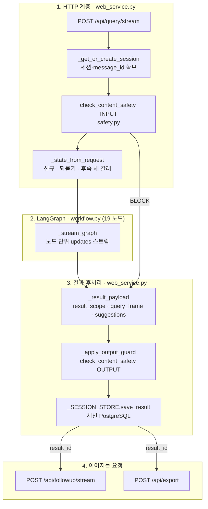
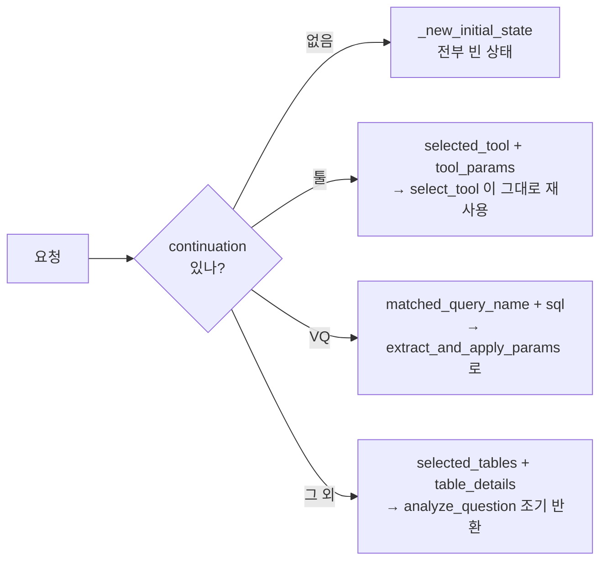
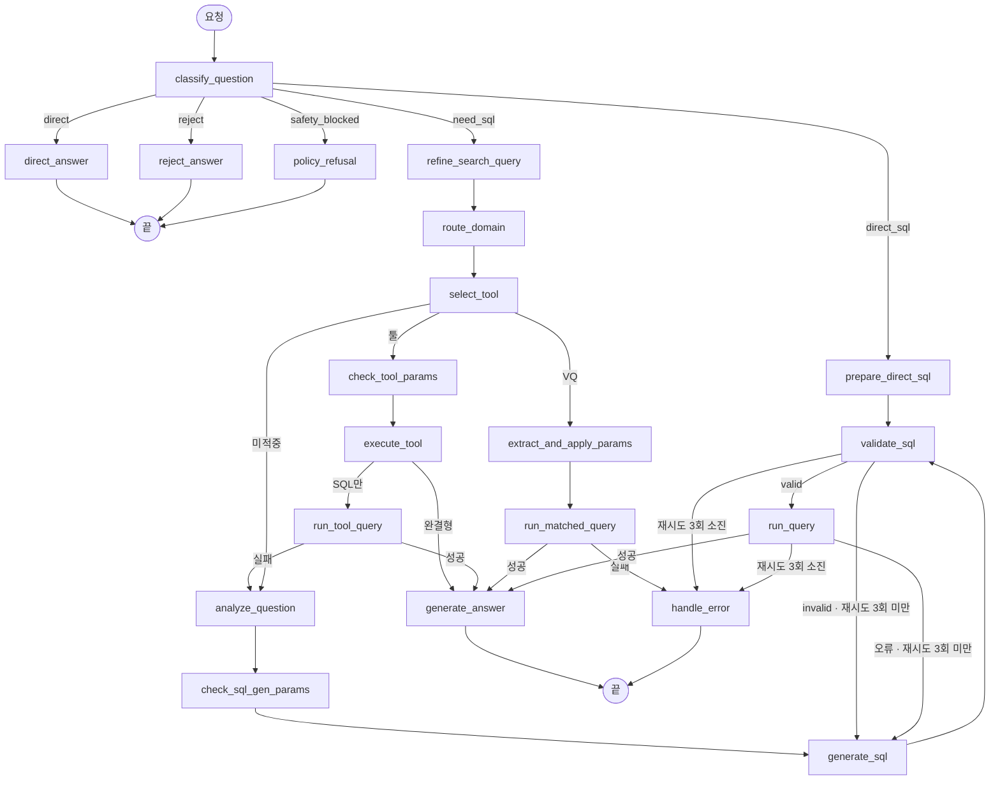
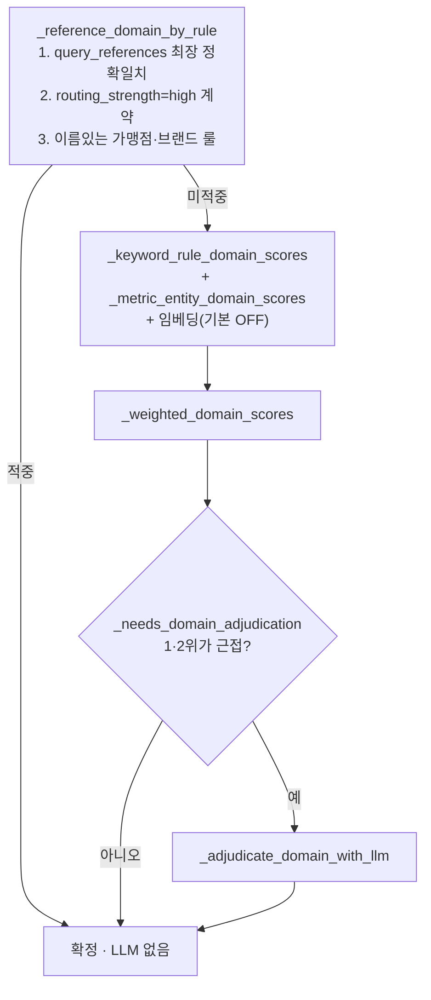
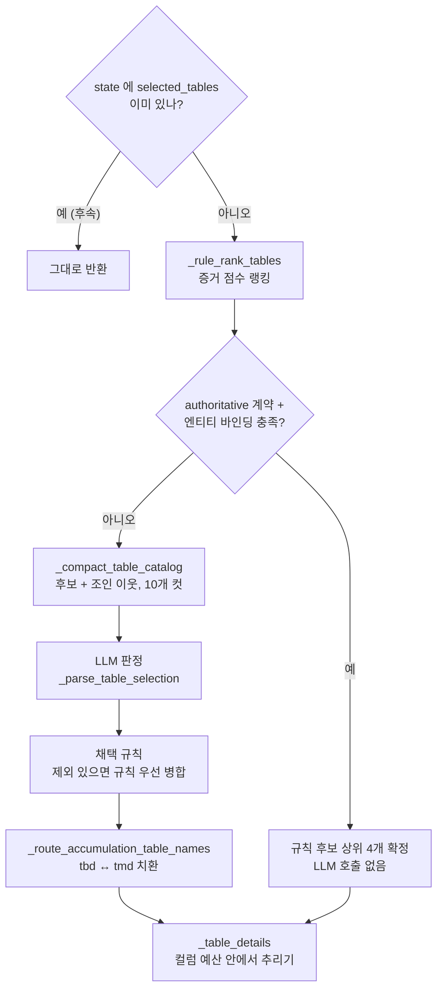
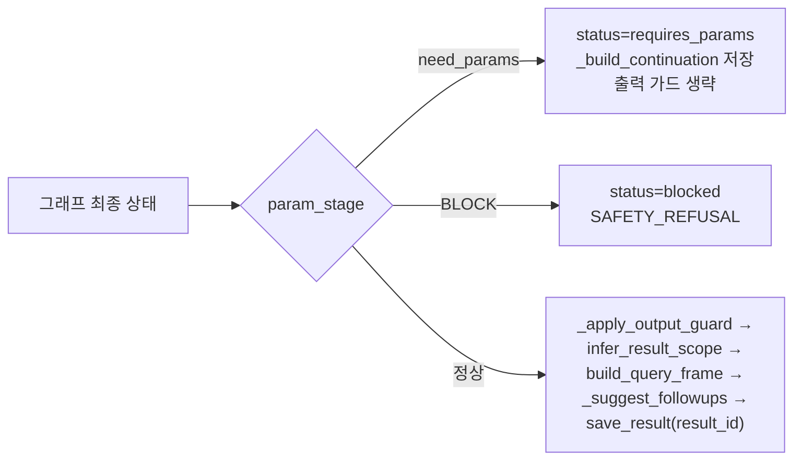
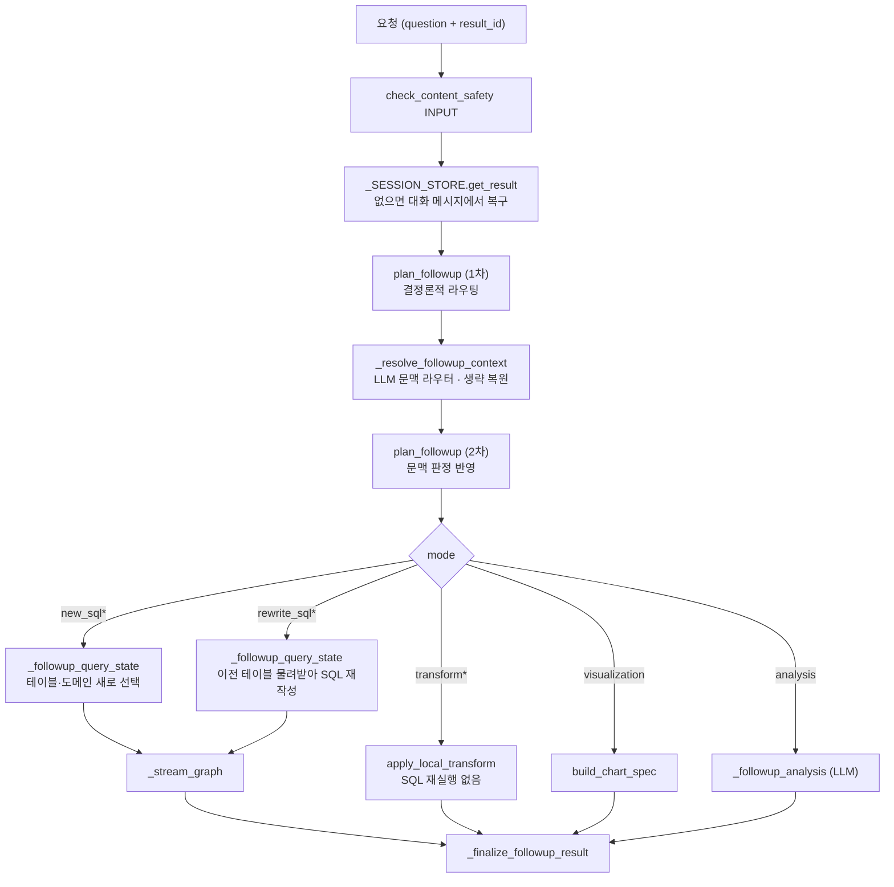

# 법인영업 Text2SQL — 질의 한 건이 처리되는 전 과정

- 기준 스냅샷: 커밋 `646383e` + 커밋 안 한 워킹트리, 2026-08-22 16:05 (`workflow.py` 333,612 B / `web_service.py` 143,252 B / `semantic_layer.yaml` 936,449 B)
- 줄번호는 이 스냅샷 기준이다. `workflow.py` 는 작업 중 계속 커지고 있으므로 (같은 세션 중에 311KB → 333KB) **함수 이름을 먼저 찾고 줄번호는 참고로만** 쓴다.
- 이 문서의 모든 예시 값은 LLM·DB 없이 결정론적 함수만 실제로 실행해 얻은 값이다. 재실행 방법은 마지막 장에 있다.
- 앞선 문서 [agent-architecture-flow.md](agent-architecture-flow.md) 는 컴포넌트·배포 관점이고, 이 문서는 **함수 호출 순서와 판단 근거** 관점이다.

---

## 0. 한눈에 보기



핵심 성질 세 가지를 먼저 알면 나머지가 쉽게 읽힌다.

1. **그래프는 요청 단위로 stateless 하다.** 멀티턴 기억은 전부 세션 저장소와 `_state_from_request` / `_followup_query_state` 가 상태 dict 를 미리 채워 주는 방식으로 들어온다.
2. **결정론적 규칙이 먼저, LLM 은 남는 자리에만.** 대부분의 노드는 "룰로 확정되면 LLM 을 아예 부르지 않는다" 구조다.
3. **되돌아가는 화살표는 두 곳뿐이다.** `validate_sql → generate_sql` 과 `run_query → generate_sql`, 둘 다 `retry_count >= 3` 에서 멈춘다.

---

## 1. HTTP 진입과 상태 조립 (그래프 밖)

### 엔드포인트

| 엔드포인트 | 함수 | 역할 |
|---|---|---|
| `POST /api/query/stream` | `query_stream` ([web_service.py:2960](../web_service.py)) | 기본 질의, SSE |
| `POST /api/query` | `query` | 같은 처리, 단발 JSON (`_run_query`) |
| `POST /api/followup/stream` | `_stream_followup` ([:2654](../web_service.py)) | 이전 결과 기반 후속 요청 |
| `POST /api/export` | `export_result` ([:3343](../web_service.py)) | word/excel/txt 내보내기 |
| `GET /api/files/{token}` | `download_file` | 토큰으로 파일 내려주기 |
| `POST /api/sessions` 외 | 세션·저장쿼리 CRUD | 대화 목록, saved query |
| `POST /api/managed-company-scope/parse` | `managed_scope` | 관리기업 명단 업로드 파싱 |

### 스트리밍 요청의 실제 호출 순서

`_stream_query` ([:1982](../web_service.py)) 가 이 순서로 돈다.

1. `agent.create_trace_context(session_id, message_id)` — 관측 컨텍스트
2. `yield _sse("start", ...)` — 화면에 "질문을 분석 중입니다..."
3. `check_content_safety(question, direction="INPUT")` ([safety.py](../text2sql_agent/safety.py)) — LLM 분류기. BLOCK 이면 그래프를 아예 실행하지 않고 `_blocked_result` 로 끝낸다
4. `_record_guarded_user_message` — 차단이면 원문 대신 `[안전 정책에 따라 차단된 요청]` 을 저장
5. `_state_from_request` — 상태 dict 조립 (아래)
6. `_stream_graph` — 그래프를 **별도 스레드**에서 돌리고 `updates` 를 큐로 받아, 노드가 끝날 때마다 `text2sql_progress` SSE 를 내보낸다. `PROGRESS_HEARTBEAT_SECONDS`(2.5초) 동안 조용하면 `heartbeat` 를 끼운다
7. `_result_payload` → `_finalize_assistant_message` → `yield _sse("done", data)`

### `_state_from_request` 의 세 갈래



`continuation` 은 직전 턴이 "파라미터가 부족하다"고 되물었을 때 서버가 만들어 둔 꾸러미(`_build_continuation`)다. 사용자가 값만 답하면(`"LS 2%, IS 1%"`) `_natural_params_by_rule` / `_natural_params_by_llm` 이 그 문장에서 값을 뽑아 원래 질문 위에 얹는다. 그래서 되묻기 다음 턴은 **도메인 라우팅·테이블 선택을 다시 하지 않는다.**

---

## 2. LangGraph 19 노드



노드 이름은 SSE 의 `text2sql_step` 값이고, 화면 문구는 `NODE_LABELS` ([web_service.py:116](../web_service.py)) 가 정한다. 예: `analyze_question` → phase `table_selection`, 제목 "테이블 분석".

되묻기(`param_stage == "need_params"`)는 `check_tool_params` · `extract_and_apply_params` · `check_sql_gen_params` 세 곳에서 그래프를 조기 종료시킨다.

---

## 3. classify_question — 질문 유형

**호출 순서** ([workflow.py:411](../text2sql_agent/workflow.py))

1. `check_content_safety` (HTTP 계층에서 이미 ALLOW 판정이 실려 오면 생략)
2. `_looks_like_direct_sql` — `^\s*(SELECT|WITH)` 정규식 하나
3. `_looks_like_schema_question` — "어느/어떤 테이블", "컬럼·스키마 + 구조·정의·목록·의미", grain/PK
4. `_rule_classify_question` — 지표어 AND (엔티티·축어 OR 시간어)
5. 셋 다 아니면 LLM 3분류 (`need_sql` / `direct` / `reject`, 파싱 실패 시 `need_sql`)

**실행 결과**

| 질문 | 판정 | 다음 노드 |
|---|---|---|
| `SELECT 가맹점명 FROM tbdaadt01 LIMIT 10` | direct_sql | `prepare_direct_sql` → `validate_sql` |
| `tbdaadt01 테이블 구조 설명해줘` | direct | `direct_answer` |
| `2026년 5월 가맹점 수를 업종별로 알려줘` | need_sql (룰) | `refine_search_query` |
| `오늘 점심 뭐 먹을까` | 룰 전부 미적중 | LLM 분류 (실무상 reject) |

`direct` 로 빠진 질문도 `direct_answer` 안에서 `_rule_rank_tables` 를 불러 "이 질문은 이 테이블이 답한다"까지 붙여 준다. 즉 테이블 랭킹 코드는 SQL 경로 전용이 아니다.

---

## 4. refine_search_query — 검색용 질의 정제

**호출 순서** ([:510](../text2sql_agent/workflow.py))

1. 이미 `retrieval_query` 가 있으면 그대로 반환
2. 후속·되묻기 흔적(`previous_question`, `selected_domain`, `selected_tables` 등)이 하나라도 있으면 원문 그대로 (재해석 금지)
3. 그 외에는 LLM 에게 "의미를 바꾸지 말고 검색용 한 문장으로" 정제 요청, 실패하면 원문

**중요한 부수 효과** — `_retrieval_question` ([:550](../text2sql_agent/workflow.py)) 은 정제문과 원문을 **줄바꿈으로 이어 붙인 두 줄 텍스트**를 돌려준다.

```
{정제된 질의}
{사용자 원문}
```

이후 모든 규칙 매칭(도메인 점수, 테이블 점수, 계약 매칭)은 이 두 줄을 함께 본다. 정제가 낱말을 바꿔도 원문 표면형이 남아 있어야 `_phrase_in_question` 이 계속 맞기 때문이다. 반대로 LLM 프롬프트의 "사용자 질문" 칸에는 항상 원문만 들어간다.

---

## 5. route_domain — 6개 도메인 중 하나

**호출 순서** ([:645](../text2sql_agent/workflow.py))



점수 함수는 모두 [schema.py](../text2sql_agent/schema.py) 에 있다 (`_keyword_rule_domain_scores:1508`, `_metric_entity_domain_scores:1561`, `_weighted_domain_scores:1628`). 임베딩 점수는 `ENABLE_EMBEDDING_PRECOMPUTE` 가 꺼져 있으면 아예 계산되지 않고 trace 에 `embedding=OFF` 로 남는다 (기본값 꺼짐).

**실행 결과**

| 질문 | 룰 판정 | 점수 1·2위 | LLM 판정 |
|---|---|---|---|
| 2026년 5월 가맹점 수를 업종별로 | `merchant_sales` | merchant_sales 23.89 / 2.56 | 안 씀 |
| 도미노피자 저번달 매출액 | `merchant_sales` | 0.80 / 0.00 | 안 씀 |
| 2026년 1월 법인카드 유이자 할부 이용금액을 카드거래매체별로 | 없음 | card_usage 14.70 / 0.80 | 안 씀 |

둘째 줄이 이 관문의 존재 이유다. 점수만 보면 0.8 대 0.0 으로 사실상 무증거여서 LLM 판정 대상인데, `_is_named_merchant_sales_question` 룰이 "이름 + 기간 + 매출" 조합을 보고 먼저 못박는다. 작은 모델이 "기업" 이라는 낱말에 끌려 영업대상 도메인으로 보내는 것을 막기 위한 장치다.

결과는 `selected_domain` 과 사람이 읽는 `domain_routing_trace` 로 상태에 남고, 그 trace 는 이후 테이블 선택·SQL 생성 프롬프트에 그대로 실린다.

---

## 6. select_tool — capability 선점

이 관문에서 뭐라도 잡히면 **테이블 선택 노드에 도달하지 않는다.** 테이블이 이미 검증된 SQL 안에 박혀 있기 때문이다.

**호출 순서** ([:3668](../text2sql_agent/workflow.py))

1. `skip_tool_selection` (후속 요청이 세운 깃발) → 즉시 빈 선택
2. 상태에 툴/VQ 가 미리 지정돼 있으면 그대로 재사용
3. `semantic_query_contract_candidates` 1건 확인
   - `support_status: blocked*` → "semantic layer 만으로는 안전하게 계산할 수 없습니다" 거절
   - `execution_mode: semantic_generation` → 툴·VQ 를 쓰지 않고 생성 경로로 표시
4. `_select_verified_query_capability` ([:4433](../text2sql_agent/workflow.py)) — 룰 → 계약 바인딩 → 임베딩(기본 OFF) → LLM(기본 OFF, `ENABLE_VERIFIED_QUERY_LLM_FALLBACK`) 순으로 VQ 매칭, 그 뒤 기간·업종·행수 요청을 그 VQ 가 정말 지원하는지 가드
5. `_rule_match_tool` — 태그 히트가 **단독 최다**일 때만 확정 (동점이면 LLM 에 위임)
6. `_tool_candidates` (2히트 이상) + `_select_tool_capability` → LLM 이 툴과 파라미터를 JSON 으로 고름
7. 그다음 `_extract_params_by_rule` 로 파라미터를 결정론적으로 덮어쓰고 `_normalize_params` 로 정규화

**실행 결과**

| 질문 | 태그 후보 | 확정 | 이후 경로 |
|---|---|---|---|
| 도미노피자 2026년 3월 대손비용률 알려줘 LS 2% IS 1% | `대손비용률_분석` | 룰로 툴 확정 | `check_tool_params` → `execute_tool` |
| 기업카드 보유회원 중 6개월 무실적 기업 회원 명단 | `corporate_card_active_no_usage_members` | 룰로 툴 확정 | 같음 |
| 2026년 5월 가맹점 수를 업종별로 | 없음 | 미적중 | `analyze_question` |

**툴 경로의 두 갈래** (`execute_tool`, [:3755](../text2sql_agent/workflow.py))

- 툴이 `is_complete: True` 를 돌려주면 SQL·행·답변·엑셀 경로까지 완성품이므로 곧장 `generate_answer` (대손비용률 툴이 이렇다)
- 툴이 SQL 문자열만 돌려주면 `_route_verified_query_accumulation` 으로 적재 정책을 적용하고 `run_tool_query` 에서 실행. 실패하면 `analyze_question` 으로 내려가 일반 생성 경로로 재시도한다

**VQ 경로** — `extract_and_apply_params` ([:4526](../text2sql_agent/workflow.py)) 가 파라미터 스펙을 만들고(`VQ_PARAM_SPECS` + VQ 자체 선언 + 사용자가 요청한 `limit`·`이름정확일치`) LLM 으로 값을 뽑은 뒤 템플릿에 채운다. 실행은 `run_matched_query`. 여기서 DB 오류가 나면 **생성 SQL 로 갈아타지 않고** `handle_error` 로 끝낸다 — 검증된 업무 필터를 조용히 잃는 것보다 실패를 보여 주는 편이 낫다는 판단이 주석으로 남아 있다.

---

## 7. analyze_question — 테이블 선택

이 관문만 다섯 칸으로 나뉜다.



### 7.1 `_rule_rank_tables` — 증거 점수 ([:5256](../text2sql_agent/workflow.py))

| 증거 | 가점 | 코드 |
|---|---|---|
| authoritative 계약의 `source_tables` | 즉시 확정 (점수 계산 생략) | `_contract_source_tables` |
| `canonical_metrics` 이름·동의어 일치 → `source_table` | +20 | |
| semantic attribute 1순위 / 이후 | +36 / 18→3 감쇠 | `semantic_attribute_candidates` |
| 그 1순위 속성이 원천을 **한 곳만** 선언 | +40 추가 | `_SINGLE_SOURCE_ATTRIBUTE_WEIGHT` |
| 계약 `source_tables` (엔티티 바인딩 충족시) | +28 | `_contract_entity_bindings_available` |
| `query_references` 표면형 **정확 일치** primary / join | +120+score / +100 | |
| 같은 참조가 낱말 겹침만 (부분 일치) | +6+score / +4 | `_FUZZY_REFERENCE_WEIGHT` |
| 테이블명·한글명·동의어가 질문에 등장 | +14 | |
| 컬럼 동의어 히트 (최대 4개) | ×3 | `_GENERIC_TABLE_TERMS` 제외 |
| 소유 테이블 3개 이하인 희소 컬럼 | +12 | `_DISTINCTIVE_WEIGHT` |
| 질문이 컬럼명을 그대로 호명 (최대 2개) | ×40 | `_v2_named_columns` |
| 질문 컬럼을 최다 보유한 테이블이 유일 | +40 | `_COVERAGE_WEIGHT` |
| 가장 구체적인 measure 를 단독 보유 | +40 | `_SOLE_MEASURE_OWNER_WEIGHT` |

3점 미만 탈락, 상위 4개만 남는다. 속성 정책이 고른 원천의 **반대편 스냅샷**은 점수와 무관하게 제거된다 (`_attribute_snapshot_exclusions`).

**실행 결과 A** — `2026년 1월 법인카드 유이자 할부 이용금액을 카드거래매체별로 알려줘`

```
tmdaa3e16   133 = 20(메트릭) + 9(참조 부분일치) + 12(컬럼 4개) + 12(희소) + 40(커버리지) + 40(단독 지표)
tmdaa1d12    36 = 36  ← "법인카드"가 corporate_card_holding 속성 코드값 이름과 같아서
tmdaaus01    36 = 36
tbdaaat05    15 = 3 + 12
```

커버리지·단독지표 80점이 없으면 정답 테이블이 3순위로 밀린다. 실제로 goldenset v3 에서 이 형태("지표 X를 축 Y별로")로 6건이 틀렸고, 그 두 규칙이 그 실패를 메운 것이다.

**실행 결과 B** — `2026년 5월 가맹점 수를 업종별로 알려줘`

```
tbdaadt01    43 = 20(가맹점수 메트릭) + 9(참조 가맹점_기본정보_검색) + 14(테이블명 "가맹점")
tbdaadb17    29 = 14 + 3 + 12
tbdaaat01    15 = 3 + 12
tmdaa1d01    15 = 3 + 12
```

**실행 결과 C** — authoritative 단축 경로 (계약 37건 중 36건이 authoritative)

```
대기업 고객 목록 보여줘             → current_enterprise_size_customer_list    → ['tbdaaat01']
2025년 6월 당시 대기업 고객 목록    → historical_enterprise_size_customer_list → ['tmdaa1d01']
```

`_contract_entity_bindings_available` 가 이 단축 경로의 안전장치다. 기업명이 required 인 계약이 이름 없는 질문까지 못박아 점수 계산 자체를 건너뛰던 버그(goldenset v2 easy 실패 6건)가 이 가드로 잡혀 있다.

### 7.2 `_compact_table_catalog` ([:5516](../text2sql_agent/workflow.py))

후보 4개 → `semantic_join_paths_for_tables` 로 직접 조인 이웃까지 확장 → 제외 목록 차감 → 10개 컷. 테이블마다 한 줄 설명 + 주요 차원 5 / 지표 4 / 시간축 3만 적는다. 가맹점 질문에서는 40줄 2,909자였다.

```
- tmdaa5d01 (가맹점월스냅샷): 가맹점정보기본(tbdaadt01)의 월별 스냅샷 테이블. ...
  주요 차원: 가맹점번호, 기업고객식별자, 기업고객관리번호, 대표고객식별자, 대표고객관리번호
  주요 지표: 금년가맹점신용판매매출금액, 전년가맹점신용판매매출금액, ...
  시간축: 기준년월, 최초심사방문년월일, 등록년월일
```

### 7.3 LLM 판정과 파서

프롬프트에 들어가는 블록: 도메인 컨텍스트 · 라우팅 근거 · LLM semantic contract · 안전 조인 그래프 · **규칙 기반 우선 후보** · 후보 카탈로그 · 용어집 · semantic attribute · 메트릭 · 계약 · 참조. 응답은 `max_tokens=192`, 테이블명만.

메트릭·계약·참조 텍스트는 `_route_merchant_time_context` ([:5218](../text2sql_agent/workflow.py))를 한 번 통과해 **프롬프트 안의 테이블명까지** 선택된 아카이브로 맞춘다. 그렇지 않으면 "월 질문인데 프롬프트에는 일 적재 테이블 이름이 보이는" 모순이 생긴다.

`_parse_table_selection` ([:5486](../text2sql_agent/workflow.py)) 실행 결과:

```
'가맹점 월별 실적 테이블(tmdaa5d01)과 업종 코드 테이블 tbdaadb17 을 조인해야 합니다.'
   -> ['tbdaadb17', 'tmdaa5d01']
'1. tmdaa5d01\n2. tbdaadb17'  -> ['tmdaa5d01', 'tbdaadb17']
'테이블명: 없음'               -> []
```

### 7.4 채택 규칙

- 스냅샷 제외가 걸린 질문 → `[*rule_tables, *llm_tables]` 중복 제거 후 4개 (결정론적 정책이 앞)
- 제외가 없으면 → `llm_tables[:4]`, 비었으면 `rule_tables[:4]`
- LLM 호출이 예외를 던지면 규칙 후보가 있을 때만 생존, 없으면 raise

### 7.5 `_route_accumulation_table_names` ([:5125](../text2sql_agent/workflow.py))

시간축 판정(`_recent_merchant_time_route` → `daily` / `monthly` / `master`)과 짝 표(`TABLE_ACCUMULATION_POLICIES.historical_source`, [time_policy.py:156](../text2sql_agent/time_policy.py))로 테이블을 교체한다.

```
2026년 5월 가맹점 수를 업종별로       cadence=monthly  → tbdaadt01 을 tmdaa5d01 로
                                     최종 ['tmdaa5d01','tbdaadb17','tbdaaat01','tmdaa1d01']
2026년 5월 기준 도미노피자 가맹점 주소  cadence=master   → 마스터 유지 + 월 스냅샷 짝 제거
                                     최종 ['tbdaadt01']   (점수상 tbdaaus01 16점이 남아 있었음)
```

`master` 판정은 `_merchant_master_attribute_question` ([:2219](../text2sql_agent/workflow.py))이 한다. 주소·기본정보처럼 마스터 한 곳만 가리키는 속성이면 월 스냅샷으로 돌려도 답할 컬럼이 없기 때문이다. 다만 집계를 묻는 표현이 있으면(메트릭 이름이나 "몇 곳") 그 달을 세는 질문이므로 스냅샷이 맞다.

### 7.6 `_table_details` ([:5653](../text2sql_agent/workflow.py))

선택된 테이블의 컬럼을 질문 근거(`_column_evidence`) 기준으로 추린다. 예산은 테이블당 16개 · 전체 48개이고, 계약이 `prompt_column_budget` 을 선언하면 상향된다. 가맹점 질문의 두 테이블은 4,306자 51줄이었다. **여기서 잘린 컬럼은 SQL 생성 단계에서 존재조차 알 수 없다** — 골든셋 실패가 이 예산에서 나오는 경우가 많다.

---

## 8. check_sql_gen_params — 되묻기 판단

`_missing_ambiguous_target_params` ([:5972](../text2sql_agent/workflow.py) 내부 호출)가 "대상명" 처럼 없으면 SQL 을 만들 수 없는 값을 찾는다. `query_frame.entities` 에 이미 대상이 있으면 그 항목은 뺀다(후속 대화에서 이미 확보한 값). 남으면 `param_stage="need_params"` 로 그래프를 끝내고, HTTP 계층이 `parameter_required` SSE 와 `continuation` 을 내보낸다.

---

## 9. generate_sql — SQL 생성

**컨텍스트 조립 순서** ([:6103](../text2sql_agent/workflow.py)) — 전부 `_route_merchant_time_context` 를 통과시켜 테이블명을 일치시킨다.

1. `find_relevant_queries` — 참고 SQL 예시
2. `find_relevant_references` — 질의 작성 reference
3. `find_relevant_semantic_query_contracts` — 재사용 계약
4. `build_metrics_summary` — 사전 정의 메트릭
5. `build_domain_context` + `domain_routing_trace`
6. `build_semantic_contract_summary` — LLM semantic contract
7. `build_semantic_join_context` — 안전 조인 그래프 (최대 5경로)
8. `state["table_details"]` — 7.6 의 산출물
9. `build_semantic_attributes_summary`, `build_glossary_summary`
10. `_multiturn_sql_context` — 이전 질문·SQL (후속일 때)
11. 재시도면 `## 이전 시도 실패` + 직전 SQL + 검증 메시지
12. 사용자가 답한 파라미터
13. `_corporate_scope_rule` — 법인 범위 필터 규칙
14. SQL 작성 규칙 17개 + `_time_resolution_instruction` + `_sql_dialect_rules`

규칙 중 실무에서 특히 자주 작동하는 것들: 13번(상세 목록 기본 LIMIT), 13-1번(지표만 덜렁 내지 말고 식별·축·분모 컬럼도 함께), 14번(이름은 기본 부분일치, "정확 일치" 라고 해야 완전일치), 15번(N개 요청 시 정렬 방향까지).

**후처리**: `_extract_sql_from_llm` → `_v2_looks_like_prose` 면 재시도로 되돌림 → `_v2_normalize_sql` → `_apply_recent_month_sql_fix` → `_apply_name_filter_mode`.

---

## 10. validate_sql — 정적 검증 게이트

**실행 순서** ([:6777](../text2sql_agent/workflow.py))

| 순서 | 함수 | 하는 일 |
|---|---|---|
| 1 | `_apply_accumulation_historical_sources` | 물리 테이블 재치환 (아래) |
| 2 | `_apply_recent_month_sql_fix`, `_apply_name_filter_mode` | 상대월·이름 매칭 교정 |
| 3 | `_v2_normalize_sql` | `expr::type` → `CAST(...)` 등 Athena 문법 |
| 4 | `_v2_repair_columns` | 축약·오타 컬럼 교정, 못 고치면 "그 컬럼은 어느 테이블에 있다"까지 적어 재시도 |
| 5 | `_validate_sql_against_schema` ([schema.py:1897](../text2sql_agent/schema.py)) | 미등록·비공개 테이블, prefix 누락, `SELECT *` |
| 6 | `_v2_audit_sql` | QUALIFY·WHERE 절 윈도함수·잘린 SQL |
| 7 | `_validate_required_semantic_tables` | 계약이 `require_all_selected_tables` 면 누락 검사 |
| 8 | `_validate_recent_month_semantics`, `_validate_requested_row_constraints`, `_validate_corporate_entity_grain`, `_validate_sales_slip_net_amount` | 업무 규칙 |
| 9 | `_availability_policy_issues` ([:6583](../text2sql_agent/workflow.py)) | 적재 주기 위반 (전일 스냅샷에 없는 날짜, 월 테이블에 없는 열린 달 등) |

하나라도 걸리면 `after_validate` 가 `generate_sql` 로 되돌리고 `retry_count` 를 올린다. `SQL_RETRY_LIMIT`(3)에 닿으면 `handle_error`. 사용자 입력 SQL(`direct_sql`)은 재시도하지 않고 바로 오류로 알린다.

**정적 검증을 통과하면 LLM 의미 검증이 한 번 더 돈다** (`max_tokens=512`). 정적 규칙으로는 못 잡는 것들을 본다 — 상대 기간 해석("저번달", "최근 6개월", "전월 대비"는 비교 연산이지 조회기간이 아니다), 이름 필터가 부분일치인지, N개 요청에 `LIMIT N` 과 방향까지 맞는 `ORDER BY` 가 있는지. 프롬프트에는 `implicit_time_basis`(시스템이 적재 범위를 읽어 정한 기준시점)도 함께 들어가서, 시스템이 정한 기준시점과 질문의 기간이 다르다는 이유로 실패 처리하지 않도록 명시한다. 응답이 `VALID` 한 단어면 통과, 문제 목록이면 재시도, **형식이 깨졌거나 빈 응답이면 통과**로 둔다 — 작은 모델의 형식 실패가 정적으로 안전한 SQL 을 서비스 실패로 바꾸지 않게 하기 위한 선택이다.

**재시도가 남지 않은 마지막 패스에서는 이 LLM 검증을 아예 건너뛴다** (`retry_count >= SQL_RETRY_LIMIT - 1`). 세 번째 검증에서 의미 판정으로 실패시켜도 그 지적을 반영해 SQL 을 고칠 기회가 이미 없어서, 사용자에게는 "SQL 오류" 만 남고 정적으로 안전한 SQL 을 실행조차 못 한 채 버리게 된다. 그래서 마지막 패스는 정적 검증까지만 하고 `VALID (정적 검증 통과, 마지막 시도라 LLM 의미 검증 생략)` 으로 실행에 넘긴다. 정적 이슈가 남아 있으면 마지막 패스에서도 그대로 실패한다 — 실행해도 DB 오류가 될 SQL 이라 넘길 이유가 없다. 검증 테스트는 [tests/test_sql_validation_retry_budget.py](../tests/test_sql_validation_retry_budget.py) 에 있다.

**재치환 실행 결과** (`_apply_accumulation_historical_sources`, [:2969](../text2sql_agent/workflow.py))

```
Q: 2026년 5월 가맹점 수를 업종별로 알려줘
before  FROM card_system.tbdaadt01 a JOIN card_system.tbdaadb17 b ...
after   FROM card_system.tmdaa5d01 a JOIN card_system.tbdaadb17 b ... WHERE a."기준년월" = '202605'

Q: 2026년 5월 기준 도미노피자 가맹점 주소 알려줘
before  FROM card_system.tmdaa5d01 a WHERE a."기준년월" = '202605'
after   FROM card_system.tbdaadt01 a WHERE a."실적기준년월일" = '20260820'
```

세 함수가 순서대로 돈다. `_apply_tbdaadt01_historical_source`(마스터↔월 아카이브) → `_apply_previous_day_historical_sources`(전일 스냅샷→월 아카이브) → `_apply_current_month_live_sources`(요청 월이 **열린 달**이면 월 원천을 일 적재 짝의 최신일로). 마지막 것은 월말 스냅샷이 그 달이 닫힌 뒤에야 적재되기 때문에 필요하다.

같은 함수가 `run_query`, `run_tool_query`, `run_matched_query`, `extract_and_apply_params` 에서도 호출된다. 어느 경로로 들어와도 물리 원천 결정은 한 곳을 지난다.

---

## 11. run_query — 실행

**호출 순서** ([:6880](../text2sql_agent/workflow.py) → [db.py:569](../text2sql_agent/db.py))

1. `_apply_accumulation_historical_sources` 한 번 더 (툴·VQ 경로에서 곧바로 들어오는 SQL 때문)
2. `prepare_sql_for_backend` — 한글 식별자 따옴표, ILIKE 정규화, 오타 교정
3. `_availability_execution_error` — 적재 범위 밖 기간이면 실행 전에 중단
4. `execute_sql(max_rows=DEFAULT_FETCH_ROW_LIMIT, allow_cross_cycle_fallback=...)` — 기본 500행까지 가져온다
   - `_validate_read_only_sql` — DDL·DML 차단
   - `_bounded_result_sql` + statement timeout
   - 결과가 0행이고 `tbd*` 테이블을 쓰면 **최대 3회 재실행** (일 적재 지연 대비), 그래도 0행이면 `_tmd_fallback_sql` 로 월 원천 폴백
5. 성공하면 `_executed_query_state` 가 `result_scope`(fetched/displayed/total)까지 채워 상태에 넣는다

오류면 `after_query` 가 `generate_sql` 로 되돌린다(3회 한도). 화면에는 최대 100행(`DISPLAY_ROW_LIMIT`)만 남기고, 전체 건수는 `count_result_rows` 로 따로 센다.

---

## 12. generate_answer — 답변 생성

**호출 순서** ([:7043](../text2sql_agent/workflow.py))

1. 이미 `answer` 가 있으면 그대로 (완결형 툴)
2. 0행이면 결정론적 문구 + `_implicit_time_basis_note` + `_open_month_live_source_notes` + `_loaded_period_notes` — "왜 없는지"를 함께 알린다
3. `_deterministic_result_answer` 로 **폴백 답변을 먼저 만든다** (LLM 실패·`direct_sql` 경로용)
4. LLM 프롬프트: 질문 · 실행 SQL(4000자) · 결과 상위 20행 · **결과 범위 문구** · `_result_summary` 계산 요약 · 기준시점 안내 · 형식(핵심 요약 표 / 주요 데이터 / 해석) · 답변 규칙 9개
5. `max_tokens=2000`, 실패하면 폴백 답변

이 노드의 설계 초점은 **건수 진실성**이다. 프롬프트에는 20행만 담기고 상태에도 100행만 남으므로, `_row_count_label` 이 "전체 N건" 또는 "N건 이상"(한도에 걸려 못 셈)을 만들어 규칙 9번으로 강제한다.

---

## 13. 결과 후처리 — `_result_payload` ([web_service.py:1527](../web_service.py))

그래프가 끝난 상태 dict 를 화면·저장·후속에 쓸 형태로 만든다. 세 갈래다.



정상 경로에서 붙는 것들:

| 항목 | 함수 | 의미 |
|---|---|---|
| `result_scope` | `infer_result_scope` ([query_frame.py:151](../text2sql_agent/query_frame.py)) | 이 결과가 전체인지 일부인지 (후속 재가공 안전성 판단에 쓰임) |
| `query_frame` | `build_query_frame` ([:228](../text2sql_agent/query_frame.py)) | 대상·기간·지표·차원·정렬을 구조화 (후속 문맥 복원의 기반) |
| `suggestions` | `_suggest_followups` | 기본은 정적 추천(`FOLLOWUP_SUGGESTION_MODE=static`), 설정하면 LLM |
| 출력 안전 | `_apply_output_guard` | `check_content_safety(direction="OUTPUT")`. BLOCK 이면 답변·SQL·행·차트를 모두 비운다 |
| 저장 | `_SESSION_STORE.save_result(result_id, ...)` | 후속·내보내기가 이 `result_id` 로 되돌아온다 |

---

## 14. 후속 요청 — `/api/followup/stream`



### `plan_followup` ([followup_ops.py:648](../text2sql_agent/followup_ops.py)) 의 판정 순서

위에서 아래로 처음 맞는 것이 이긴다.

1. "새로 조회 / 다른 테이블 / 조인 / 합쳐" → `new_sql`
2. 요청한 지표가 현재 결과에 없음(`_metric_is_available`) → `new_sql`
3. 시계열을 물었는데 현재 결과에 시간축이 없음 → `new_sql`
4. SQL 어휘("where", "group by")나 기간 값이 바뀜 → `rewrite_sql`
5. 로컬 재가공이 가능하지만 **결과가 일부뿐**(`result_scope.is_complete=False`)이고 그 연산이 전체를 요구함 → `rewrite_sql`
6. 로컬 재가공 가능 → `transform` (+시각화 요청이면 `transform_visualization`)
7. 시각화만 요청 → `visualization`
8. "조회·조건·필터·월별·업종별·제외" 같은 말 → `rewrite_sql`
9. 나머지 → `analysis`

그다음 LLM 문맥 라우터(`relation` = existing_result / refine_query / new_query)가 **일을 키우는 방향으로만** 덮어쓴다. `new_query` 면 `new_sql`, `refine_query` + `rediscover` 면 `new_sql`, `refine_query` + 나머지면 `rewrite_sql`. 결정론적 안전 규칙이 이미 SQL 재실행을 요구했다면 그것이 유지된다.

`_resolve_followup_context` ([web_service.py:2280](../web_service.py))는 `_fallback_followup_context` 를 먼저 만들어 두고, 그것이 "이름만 바뀐 결정론적 교체"(`deterministic_entity_replacement`)면 LLM 을 아예 부르지 않는다. LLM 응답이 스키마에 안 맞으면 폴백으로 되돌린다.

### 상태 승계 규칙 (`_followup_query_state`, [:2410](../web_service.py))

- `skip_tool_selection` / `skip_verified_query_matching` = `relation != "new_query"` — 후속에서 툴·VQ 를 다시 잡지 않는다
- `reroute_sources`(= `new_sql*`) 가 아니면 도메인·테이블·`table_details` 를 그대로 물려받는다 → `analyze_question` 이 첫 줄에서 조기 반환
- 직전 턴이 실패해 행이 없으면(`previous_turn_failed_requires_sql`) 대화를 끊지 않고 이어받은 조건으로 SQL 을 다시 만든다

### 로컬 재가공 (`apply_local_transform`, [:400](../text2sql_agent/followup_ops.py))

정렬·필터·상위 N·그룹 집계·엔티티 카운트를 저장된 행 위에서 계산한다. 축·지표 선택에 규칙이 많다 — 시간 컬럼과 식별자 컬럼은 지표에서 빼고(`_is_time_column`, `_is_identifier_column`), 율·비율·평균은 합산하지 않고(`_is_additive_column`), 라벨이 전부 같은 축은 x축으로 쓰지 않는다(`_label_dimension`).

---

## 15. 내보내기와 파일

`POST /api/export` → `_SESSION_STORE.get_result(result_id, user_id)` 로 결과를 되찾고 `exports.py` 가 word/excel/txt 를 만든다. 화면에 남은 100행이 아니라 **전체 데이터를 다시 조회**하며(`EXPORT_QUERY_TIMEOUT_MS=300초`, `MAX_QUERY_ROW_LIMIT=1,000,000`), 실패하면 "다운로드용 전체 데이터를 조회하지 못했습니다" 로 구분해 알린다. 만들어진 파일은 세션 저장소에 토큰으로 등록되고 `GET /api/files/{token}` 으로 내려간다.

---

## 16. 실패·재시도 지도

| 어디서 | 무엇이 실패 | 어떻게 |
|---|---|---|
| HTTP 입구 | 안전 정책 BLOCK | 그래프 미실행, `SAFETY_REFUSAL` |
| `select_tool` | 계약이 `blocked` | 왜 계산할 수 없는지 조목별로 답변 |
| `check_*_params` | 필수값 부족 | `parameter_required` + `continuation`, 다음 턴에 값만 받아 이어감 |
| `validate_sql` | 정적 이슈 | `generate_sql` 재시도, 3회 후 `handle_error` |
| `validate_sql` | LLM 검증기 형식 오류 | 통과로 처리 (서비스 실패로 만들지 않음) |
| `validate_sql` | 마지막 패스 (재시도 없음) | LLM 의미 검증 생략, 정적 검증만으로 실행 |
| `run_query` | DB 오류 | `generate_sql` 재시도, 3회 후 `handle_error` |
| `run_query` | 적재 범위 밖 기간 | 재시도 대신 "최신 가용일" 안내 (`_NO_DATA_VALIDATION_RE`) |
| `run_query` | `tbd*` 0행 | 3회 재실행 후 `tmd*` 폴백 |
| `run_tool_query` | 툴 SQL 실패 | `analyze_question` 으로 내려가 일반 생성 경로 |
| `run_matched_query` | VQ 실패 | 생성 SQL 로 갈아타지 않고 오류 (업무 필터 유실 방지) |
| `generate_answer` | LLM 실패 | `_deterministic_result_answer` 폴백 |
| 후속 | 이전 결과 유실 | 대화 메시지에서 복구, 그래도 없으면 오류 |

---

## 17. LLM 이 호출되는 지점

| 지점 | 함수 | max_tokens | 건너뛸 수 있나 |
|---|---|---|---|
| 입력 안전 | `check_content_safety` | 160 | 아니오 |
| 질문 분류 | `classify_question` | 128 | 룰 3개가 잡으면 예 |
| 질의 정제 | `refine_search_query` | 256 | 후속·되묻기면 예 |
| 도메인 판정 | `_adjudicate_domain_with_llm` | — | 룰 적중·단독 우세면 예 |
| VQ 매칭 | `_match_vq_by_llm` | 128 | 기본 꺼짐 |
| 툴 선택 | `_extract_tool_selection_with_llm` | 384 | 룰 단독 최다면 예 |
| VQ 파라미터 | `extract_and_apply_params` | 512 | 아니오 (VQ 경로) |
| **테이블 선택** | `analyze_question` | 192 | authoritative 계약이면 예 |
| **SQL 생성** | `generate_sql` | 4096 | 아니오 |
| SQL 의미 검증 | `validate_sql` | 512 | 정적 이슈가 있으면·마지막 패스면 예 |
| 답변 생성 | `generate_answer` | 2000 | 완결형 툴·0행이면 예 |
| 출력 안전 | `_apply_output_guard` | 160 | 되묻기·차단이면 예 |
| 후속 문맥 | `_resolve_followup_context` | 700 | 결정론적 이름 교체면 예 |
| 후속 분석 | `_followup_analysis` | 1600 | SQL·재가공 경로면 예 |
| 후속 추천 | `_llm_followups` | 640 | 기본 꺼짐(static) |
| 직접 답변 | `direct_answer` | 1000 | need_sql 이면 예 |

임베딩은 `ENABLE_EMBEDDING_PRECOMPUTE` 가 꺼져 있으면 아예 계산되지 않는다(기본값 꺼짐). 즉 기본 설정에서 VQ 임베딩 매칭과 도메인 임베딩 점수는 둘 다 작동하지 않고, trace 에 `embedding=OFF` 로 남는다.

---

## 18. 워크스루 — `2026년 5월 가맹점 수를 업종별로 알려줘`

결정론적 구간은 실제 실행값이고, LLM 구간은 `(모델)` 로 표시했다.

| # | 노드·함수 | 결과 |
|---|---|---|
| 1 | `check_content_safety` | ALLOW |
| 2 | `_state_from_request` | continuation 없음 → 빈 초기 상태 |
| 3 | `classify_question` → `_rule_classify_question` | `True` → need_sql, LLM 생략 |
| 4 | `refine_search_query` | (모델) 정제문 + 원문 두 줄 |
| 5 | `route_domain` → `_reference_domain_by_rule` | `merchant_sales` (점수 23.89 로도 단독 1위) |
| 6 | `select_tool` → `_tool_candidates` / `_match_vq_by_rules` | 후보 0건, VQ 없음 → `analyze_question` |
| 7 | `_rule_rank_tables` | `tbdaadt01` 43, `tbdaadb17` 29, `tbdaaat01` 15, `tmdaa1d01` 15 |
| 8 | `_attribute_snapshot_exclusions` | 없음 |
| 9 | `_compact_table_catalog` | 후보 4개 + 조인 이웃 → 10개, 40줄 2,909자 |
| 10 | LLM 판정 | (모델) 테이블명 반환 → `_parse_table_selection` |
| 11 | 채택 규칙 | 제외 없음 → LLM 결과 우선 |
| 12 | `_route_accumulation_table_names` | `cadence=monthly` → `tbdaadt01` → `tmdaa5d01`<br/>최종 `['tmdaa5d01','tbdaadb17','tbdaaat01','tmdaa1d01']` |
| 13 | `_table_details` | 선택 테이블 컬럼 요약 (2개 테이블이면 4,306자 51줄) |
| 14 | `check_sql_gen_params` | 되묻을 값 없음 |
| 15 | `generate_sql` | (모델) `tmdaa5d01` + `tbdaadb17` 조인, `기준년월='202605'`, 업종별 `COUNT(DISTINCT 가맹점번호)` |
| 16 | `validate_sql` | 재치환 → 스키마 검증 → 적재 정책 → (모델) 의미 검증 → VALID |
| 17 | `run_query` → `execute_sql` | 읽기 전용 확인 → 실행 → `result_scope` 기록 |
| 18 | `generate_answer` | (모델) 핵심 요약 표 + 주요 데이터 + 해석, 건수는 전체 건수로 |
| 19 | `_result_payload` | 출력 안전 → `query_frame` → 추천 → `result_id` 저장 |

같은 질문에서 `2026년 5월` 을 빼고 `도미노피자 가맹점 주소` 를 물으면 7번이 `tbdaadt01` 하나로 좁혀지고(속성이 마스터만 가리킴), 12번이 `master` 로 판정해 월 스냅샷 후보를 걷어내며, 16번에서 기준일이 최신 가용일(`20260820`)로 바뀐다.

---

## 19. 이 문서를 다시 검증하는 방법

`workflow.py` 는 자주 바뀐다. 숫자가 문서와 다르면 아래로 직접 확인한다. 모두 LLM·DB 없이 돈다.

**테이블 점수 내역**

```python
# PYTHONPATH=. python this.py "질문"
import sys
from text2sql_agent import workflow as w

log = []
def tracer(frame, event, arg):
    if frame.f_code is w._rule_rank_tables.__code__:
        return tracer
    if frame.f_code.co_name == "add" and event == "call" and "table_name" in frame.f_locals:
        log.append((str(frame.f_locals["table_name"]), frame.f_locals["score"]))
    return tracer

for q in sys.argv[1:]:
    log.clear()
    sys.settrace(tracer); result = w._rule_rank_tables(q); sys.settrace(None)
    agg = {}
    for name, score in log:
        agg.setdefault(name.rsplit(".", 1)[-1], []).append(score)
    print(q)
    for name, scores in sorted(agg.items(), key=lambda kv: -sum(kv[1]))[:5]:
        print(f"   {name}: {sum(scores)} = {' + '.join(map(str, scores))}")
    print("   ->", result)
```

**단계별 판정**

```python
from text2sql_agent import workflow as w
from text2sql_agent.schema import SCHEMA
q = "질문"
w._rule_classify_question(q)                       # 분류 룰
w._reference_domain_by_rule(q)                     # 도메인 룰
w._rule_match_tool(q); w._tool_candidates(q)       # 툴 선점
w._match_vq_by_rules(q)                            # VQ 룰
w.semantic_query_contract_candidates(SCHEMA, q, max_count=2)   # 계약
w.semantic_attribute_candidates(SCHEMA, q, max_count=3)        # 속성
w._attribute_snapshot_exclusions(q)                # 후보 제외
w._recent_merchant_time_route(q)                   # daily/monthly/master
w._rule_rank_tables(q)                             # 최종 후보
w._compact_table_catalog(w._rule_rank_tables(q), w._attribute_snapshot_exclusions(q))
w._table_details(w._rule_rank_tables(q), q)        # 프롬프트 컬럼
w._apply_accumulation_historical_sources(q, sql)   # 물리 테이블 재치환
```

**회귀 테스트** — 라우팅·적재 정책을 건드렸으면 이 묶음이 가장 빠르다.

```bash
python -m pytest tests/test_metric_by_dimension_routing.py tests/test_table_accumulation_policy.py tests/test_domain_routing_grain.py tests/test_merchant_credit_sales_source.py tests/test_sql_validation_retry_budget.py -q
```

전체 `pytest` 는 이 스냅샷에서 **1,325 passed / 38 failed** 이고, 실패 38건은 전부 `tests/test_xlsx_semantic_failures.py` 의 기존 상태(baseline 부터 깨져 있음)다. 회귀로 착각하지 않는다.
